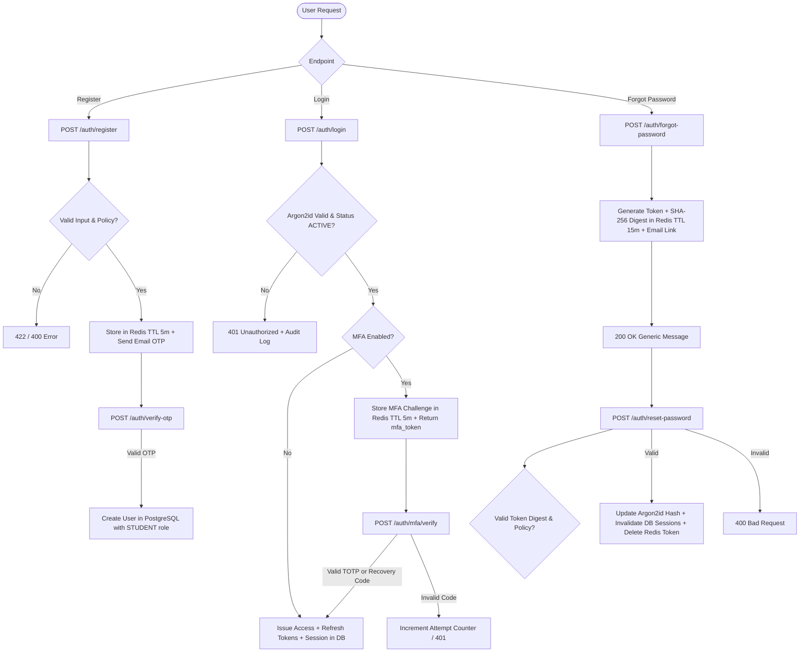

# PustakHub — Authentication & Identity Architecture (Phase 3 & Phase 7)

## 1. Overview

PustakHub implements an enterprise-grade, defense-in-depth authentication, authorization, and identity recovery system built with FastAPI, PostgreSQL 17, Redis, Argon2id, signed JWTs, and RFC 6238 TOTP Multi-Factor Authentication.

Key security principles:
- **Zero-Unverified Accounts in Database:** PostgreSQL `User` records are created **only after** successful email OTP verification. Unverified registrations reside exclusively in Redis as short-lived, expiring records.
- **Argon2id Password Hashing:** Memory-hard, timing-resistant password hashing using standard Argon2id parameters.
- **Cryptographic Token & OTP Generation:** All OTPs, password reset tokens, MFA secrets, and challenge tokens are generated using cryptographically strong system entropy (`secrets` module).
- **Zero Plaintext Secret Storage:** Reset tokens, refresh tokens, and MFA recovery codes are persisted exclusively as SHA-256 digests. Passwords use Argon2id. No plaintext credentials ever appear in database tables, logs, or audit records.
- **Anti-Account Enumeration:** Password reset requests return identical generic messages regardless of whether an account exists or is eligible.
- **Single-Use Invalidation:** Password reset tokens and MFA recovery codes are consumed immediately upon first valid use.
- **Security Boundary Session Revocation:** Successful password reset automatically revokes all existing refresh sessions in PostgreSQL.
- **RFC 6238 TOTP Multi-Factor Authentication:** Standards-compliant Time-based One-Time Passwords compatible with Google Authenticator, Microsoft Authenticator, Authy, and 1Password.

---

## 2. End-to-End Authentication Architecture



---

## 3. Password Reset & Account Recovery

### 3.1 Forgot-Password Flow
- **Endpoint:** `POST /api/v1/auth/forgot-password`
- **Request Body:** `{ "email": "user@example.com" }`
- **Anti-Enumeration Guarantee:** Regardless of whether the email exists, is active, or is unverified, the endpoint consistently returns:
  ```json
  {
    "message": "If an account exists for this email, password reset instructions have been sent."
  }
  ```
- **Token Generation:**
  - Raw Token: High-entropy string (`secrets.token_urlsafe(32)`).
  - Storage Digest: `SHA-256(raw_token)` hex digest stored in Redis under key `pwd_reset:<digest>`.
  - TTL: Configurable, default 15 minutes (`PASSWORD_RESET_EXPIRE_MINUTES`).
  - Cooldown: Redis key `pwd_reset_cd:<user_id>` (TTL 60s) prevents rapid email flooding.
  - Dispatch: Reset email dispatched asynchronously or via mock email provider containing reset URL.

### 3.2 Reset-Password Flow
- **Endpoint:** `POST /api/v1/auth/reset-password`
- **Request Body:** `{ "token": "<raw_token>", "new_password": "<new_strong_password>" }`
- **Execution Lifecycle:**
  1. Hash supplied token with SHA-256.
  2. Lookup `pwd_reset:<digest>` in Redis.
  3. Validate account status in PostgreSQL (must be `ACTIVE`; `SUSPENDED` or `DEACTIVATED` accounts are denied reset to prevent unauthorized reactivation).
  4. Enforce existing password strength validation rules (minimum 8 characters, upper, lower, digit, special character).
  5. Compute new Argon2id password hash.
  6. Update `users.password_hash` in PostgreSQL.
  7. Delete `pwd_reset:<digest>` from Redis (strictly guaranteeing single-use consumption).
  8. Revoke all active sessions for the user (`UPDATE user_sessions SET is_revoked = true WHERE user_id = :id`).
  9. Record `PASSWORD_RESET_COMPLETED` audit log.
  10. Return generic success message.

---

## 4. Multi-Factor Authentication (MFA - TOTP)

### 4.1 MFA Enrollment
- **Endpoint:** `POST /api/v1/auth/mfa/enroll` (Requires authenticated Bearer token)
- **Lifecycle:**
  1. Generates standard base32 TOTP secret (`pyotp.random_base32()`).
  2. Generates standard `otpauth://` provisioning URI with issuer name `PustakHub`.
  3. Generates 8 cryptographically random recovery codes (format `XXXX-XXXX-XXXX`).
  4. Computes SHA-256 digests for all recovery codes.
  5. Stores pending enrollment state in Redis under `mfa_enroll:<user_id>` with a 10-minute TTL.
  6. Returns secret, provisioning URI, and plaintext recovery codes to the client for display.
  7. **Crucial Invariant:** MFA is **NOT** active at this stage.

### 4.2 Verify Enrollment & Activation
- **Endpoint:** `POST /api/v1/auth/mfa/verify-enrollment` (Authenticated)
- **Request Body:** `{ "totp_code": "123456" }`
- **Lifecycle:**
  1. Retrieves pending secret and recovery code hashes from Redis.
  2. Validates 6-digit TOTP code using `pyotp.TOTP(secret).verify(code, valid_window=1)`.
  3. Upon success, commits `is_mfa_enabled = True`, `mfa_secret = secret`, and `mfa_recovery_codes = [hashes]` to PostgreSQL `users` table.
  4. Purges pending enrollment state from Redis.
  5. Emits `MFA_ENABLED` audit log.

### 4.3 MFA Login Challenge & Verification
- **Login Interception:**
  - If a user has `is_mfa_enabled = True`, `POST /api/v1/auth/login` verifies the password via Argon2id, but **does not issue access or refresh tokens**.
  - Instead, it returns:
    ```json
    {
      "mfa_required": true,
      "mfa_token": "<high_entropy_challenge_token>",
      "message": "Two-factor authentication required."
    }
    ```
  - An intermediate challenge record is stored in Redis under `mfa_challenge:<SHA256(mfa_token)>` with a 5-minute TTL.
- **Challenge Verification:**
  - **Endpoint:** `POST /api/v1/auth/mfa/verify`
  - **Request Body:**
    ```json
    {
      "mfa_token": "<challenge_token>",
      "code": "123456",
      "is_recovery_code": false
    }
    ```
  - If `is_recovery_code == false`: Validates TOTP code against `user.mfa_secret`.
  - If `is_recovery_code == true`: Validates `SHA-256(code)` against stored hashes, removes the matching hash from `user.mfa_recovery_codes` in PostgreSQL (single-use consumption), and emits `MFA_RECOVERY_USED` audit log.
  - Throttling: Up to 5 failed attempts allowed before challenge token is deleted from Redis.
  - On success: Issues standard JWT access token, refresh token, creates `user_sessions` record, deletes challenge from Redis, and returns `LoginResponse`.

### 4.4 MFA Disablement
- **Endpoint:** `POST /api/v1/auth/mfa/disable` (Authenticated)
- **Request Body:** `{ "password": "<current_password>", "code": "<totp_or_recovery_code>" }`
- **Security Requirement:** Requires both password re-authentication and second-factor verification to prevent session hijackers from disabling MFA.
- **On Success:** Sets `is_mfa_enabled = False`, clears `mfa_secret` and `mfa_recovery_codes`, and emits `MFA_DISABLED` audit log.

### 4.5 Safe MFA Status Inspection
- **Endpoint:** `GET /api/v1/auth/mfa/status` (Authenticated)
- **Response:**
  ```json
  {
    "is_mfa_enabled": true
  }
  ```
- **Concealment Guarantee:** Never exposes TOTP secrets, recovery codes, or hashes.

---

## 5. Security Audit Logging

All Phase 7 security events are logged using `audit_service.log(...)` into PostgreSQL `audit_logs`:

| Action | Description | Sensitive Secrets Masked |
|---|---|---|
| `PASSWORD_RESET_REQUESTED` | Password reset link generated | No tokens or hashes stored |
| `PASSWORD_RESET_COMPLETED` | Password successfully updated | No passwords or hashes stored |
| `PASSWORD_RESET_FAILED` | Failed reset attempt or expired token | No raw inputs stored |
| `MFA_ENROLLMENT_STARTED` | User initiated TOTP enrollment | Secrets excluded from audit |
| `MFA_ENABLED` | MFA verified and activated | No TOTP codes or recovery codes stored |
| `MFA_VERIFICATION_FAILED` | Invalid TOTP or recovery code during login | No submitted codes stored |
| `MFA_RECOVERY_USED` | Successful login via backup recovery code | Consumed code hash updated in user row |
| `MFA_DISABLED` | User disabled MFA with re-authentication | Safe metadata only |

---

## 6. Frontend Authentication Routing

| Route | Component | Access Type | Description |
|---|---|---|---|
| `/login` | `LoginPage` | Guest | Login form; redirects to `/mfa-verify` if MFA enabled |
| `/register` | `RegisterPage` | Guest | Student registration with password strength meter |
| `/verify-otp` | `VerifyOtpPage` | Guest | Email OTP verification |
| `/forgot-password` | `ForgotPasswordPage` | Guest / Public | Anti-enumeration forgot password form |
| `/reset-password` | `ResetPasswordPage` | Guest / Public | Set new password with token query parameter |
| `/mfa-verify` | `MfaVerificationPage` | Guest / Public | 6-digit TOTP challenge input |
| `/mfa-recovery` | `MfaRecoveryPage` | Guest / Public | One-time recovery code input |
| `/security/mfa` | `MfaEnrollmentPage` | Protected | Authenticated TOTP setup, QR code, and disablement |
| `/dashboard` | `DashboardPreviewPage` | Protected | User dashboard & profile preview |

---

## 7. Local ADMIN Bootstrap (Development / Local Infrastructure)

To provision initial administrative access safely without exposing privileged registration endpoints or backdoor APIs:

### Local ADMIN Bootstrap CLI

Command:
```bash
python -m app.cli create-admin
```

#### Workflow:
1. Run it from the backend environment (`backend/` with active virtualenv).
2. Enter full name interactively.
3. Enter email address.
4. Enter password securely (input is hidden via `getpass`).
5. Confirm password securely.
6. The account is created directly as an `ACTIVE` user with the `ADMIN` role.
7. Log into the normal PustakHub login page at `/login`.
8. Use the existing authenticated ADMIN IAM UI at `/users` to assign/revoke roles and manage system permissions.

#### Security Guarantees:
- **Public Registration Invariant:** Public registration (`POST /api/v1/auth/register`) ALWAYS creates `STUDENT` accounts. It does NOT accept role selection.
- **Out-of-Band Boundary:** Initial `ADMIN` provisioning occurs strictly via the local command line, outside HTTP interfaces.
- **Zero Hardcoded Secrets:** Passwords and credentials are NEVER stored, printed, logged, or hardcoded in source files.
- **Strict Anti-Promotion Safety:** If the entered email already exists, the command fails safely (`An account with this email already exists. No changes were made.`) without silently elevating existing users or altering roles.
- **Cryptographic Hashing:** Uses the existing application `Argon2id` password hasher and password policy rules.
- **Audit Logging:** Logs a `USER_CREATED` audit event in PostgreSQL (`audit_logs`) without leaking secrets.
- **Test Database Isolation:** Test runs execute exclusively against isolated test databases (`pustakhub_test`), ensuring zero pollution of development data.

---

## 8. Future Enhancements & Deferred Work

- OAuth 2.0 / OpenID Connect (Google, GitHub)
- FIDO2 / WebAuthn Passkeys
- SMS & Voice OTP Multi-Factor Authentication
- Hardware Security Module (HSM) / Cloud KMS integration for envelope master keys
- HttpOnly cookie-based refresh token transport architecture
