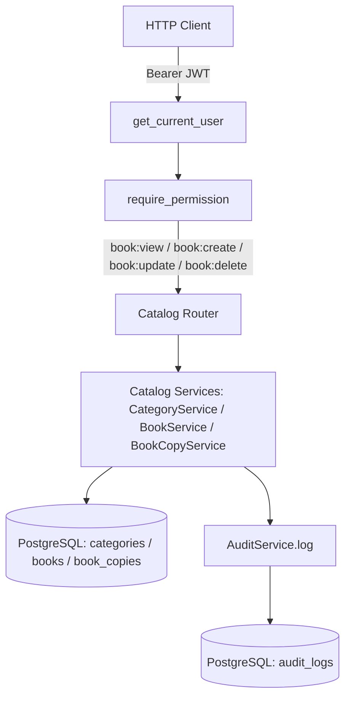
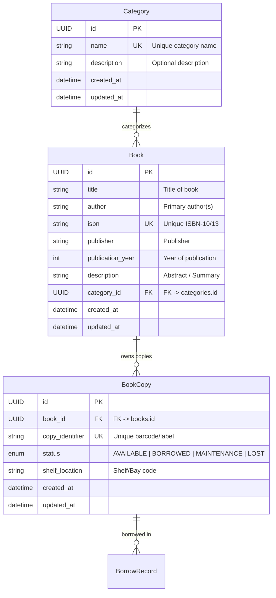
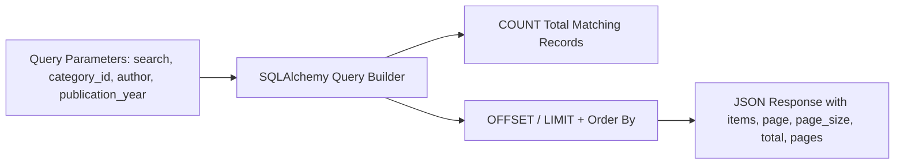

# PustakHub — Library Catalog Management

> **Phase 5 — Library Catalog Management Architecture & API Specification**  
> Last updated: 2026-09-24

---

## Table of Contents

1. [Architecture Overview](#1-architecture-overview)
2. [Data Model & Entity Relationships](#2-data-model--entity-relationships)
3. [Category Management](#3-category-management)
4. [Book Management](#4-book-management)
5. [Book Copy Inventory Management](#5-book-copy-inventory-management)
6. [Catalog Search, Filtering & Pagination](#6-catalog-search-filtering--pagination)
7. [Validation & Referential Integrity](#7-validation--referential-integrity)
8. [Role-Based Access Control (RBAC) Enforcement](#8-role-based-access-control-rbac-enforcement)
9. [Audit Logging & Security Forensics](#9-audit-logging--security-forensics)
10. [API Endpoint Reference](#10-api-endpoint-reference)
11. [Deferred Features](#11-deferred-features)

---

## 1. Architecture Overview

The **Library Catalog Management** module delivers high-performance, secure backend APIs for organizing categories, managing book titles, maintaining physical inventory (book copies), and searching the library catalog.



### Core Design Principles
1. **Separation of Title and Physical Copy:** `Book` represents intellectual/catalog metadata (Title, Author, ISBN, Publisher, Year), while `BookCopy` represents individual physical inventory items with unique barcode identifiers and shelf locations.
2. **Authoritative Backend RBAC:** All catalog routes enforce fine-grained permissions (`book:view`, `book:create`, `book:update`, `book:delete`) evaluated dynamically from PostgreSQL user roles.
3. **Strict Referential Integrity:** Categories cannot be deleted while containing books; books cannot be deleted while possessing physical copies in inventory; copies cannot be deleted while actively checked out.
4. **Resilient Audit Trail:** All mutations (Create, Update, Delete) record tamper-resistant audit logs linking the actor UUID, client IP, User-Agent, and affected entity without leaking confidential information.

---

## 2. Data Model & Entity Relationships



---

## 3. Category Management

Categories provide hierarchical taxonomy for books (e.g., *Computer Science*, *Distributed Systems*, *Literature*).

### Business Rules:
- **Unique Name Constraint:** Category names must be unique across the library (case-insensitively validated).
- **Deletion Protection:** Attempting to delete a category that still has books associated with it raises `409 Conflict`.
- **Dynamic Book Counts:** Category responses dynamically compute the count of associated books without full table scans.

---

## 4. Book Management

The `Book` entity stores bibliographic metadata.

### Business Rules:
- **ISBN Uniqueness:** ISBN values (when present) must be unique across the catalog.
- **Category Reference Validation:** Assigning an invalid or nonexistent `category_id` raises `404 Not Found`.
- **Physical Copy Inventory Protection:** Deletion of a book title is blocked with `409 Conflict` if physical copies remain registered in inventory.
- **Computed Availability:** Book detail queries compute `total_copies` and `available_copies` dynamically based on registered copy statuses.

---

## 5. Book Copy Inventory Management

Physical items are tracked independently from titles.

### Status Transitions:
- `AVAILABLE`: Ready on shelf for member borrowing.
- `BORROWED`: Currently issued to a member (managed in Phase 6).
- `MAINTENANCE`: In repair/rebinding.
- `LOST`: Reported lost or unreturned.

### Integrity Rules:
- `copy_identifier` (e.g. `CC-001`) must be unique across the entire library system.
- Physical copies linked to an active `BorrowRecord` (`status = ACTIVE`) cannot be deleted (`409 Conflict`).

---

## 6. Catalog Search, Filtering & Pagination

The catalog retrieval engine executes optimized PostgreSQL queries.



### Search Capabilities:
- Keyword substring search matches across `title`, `author`, `isbn`, and `publisher`.
- Filter by exact `category_id` (UUID).
- Filter by `author` substring.
- Filter by exact 4-digit `publication_year`.

### Pagination Shape:
```json
{
  "items": [],
  "page": 1,
  "page_size": 20,
  "total": 142,
  "pages": 8
}
```

---

## 7. Validation & Referential Integrity

| Error Case | HTTP Status | Response Code | Description |
|---|---|---|---|
| Unauthenticated request | `401 Unauthorized` | `not_authenticated` | Missing or invalid Bearer JWT. |
| Missing required permission | `403 Forbidden` | `forbidden` | Authenticated user lacks permission (e.g. STUDENT attempting book creation). |
| Resource not found | `404 Not Found` | `not_found` | Target Category, Book, or BookCopy UUID does not exist. |
| Duplicate Category Name | `409 Conflict` | `conflict` | Category with this name already exists. |
| Duplicate Book ISBN | `409 Conflict` | `conflict` | Book with this ISBN already exists. |
| Duplicate Copy Barcode | `409 Conflict` | `conflict` | Physical copy barcode already registered. |
| Deleting Category with books | `409 Conflict` | `conflict` | Cannot delete category with assigned books. |
| Deleting Book with copies | `409 Conflict` | `conflict` | Cannot delete book title with copies in inventory. |
| Deleting Borrowed Copy | `409 Conflict` | `conflict` | Cannot delete copy currently in active borrow. |

---

## 8. Role-Based Access Control (RBAC) Enforcement

Permissions are mapped per the authoritative Phase 4 RBAC matrix:

| Endpoint | Action | Required Permission | ADMIN | LIBRARIAN | STUDENT | GUEST |
|---|---|---|:---:|:---:|:---:|:---:|
| `GET /api/v1/categories` | List categories | `book:view` | ✓ | ✓ | ✓ | ✓* |
| `GET /api/v1/categories/{id}` | Get category | `book:view` | ✓ | ✓ | ✓ | ✓* |
| `POST /api/v1/categories` | Create category | `book:create` | ✓ | ✓ | ✗ | ✗ |
| `PUT /api/v1/categories/{id}` | Update category | `book:update` | ✓ | ✓ | ✗ | ✗ |
| `DELETE /api/v1/categories/{id}` | Delete category | `book:delete` | ✓ | ✓ | ✗ | ✗ |
| `GET /api/v1/books` | Search / List books | `book:view` | ✓ | ✓ | ✓ | ✓* |
| `GET /api/v1/books/{id}` | Get book details | `book:view` | ✓ | ✓ | ✓ | ✓* |
| `POST /api/v1/books` | Create book title | `book:create` | ✓ | ✓ | ✗ | ✗ |
| `PUT /api/v1/books/{id}` | Update book | `book:update` | ✓ | ✓ | ✗ | ✗ |
| `DELETE /api/v1/books/{id}` | Delete book | `book:delete` | ✓ | ✓ | ✗ | ✗ |
| `GET /api/v1/books/{id}/copies` | List book copies | `book:view` | ✓ | ✓ | ✓ | ✓* |
| `POST /api/v1/books/{id}/copies` | Add physical copy | `book:create` | ✓ | ✓ | ✗ | ✗ |
| `GET /api/v1/copies/{id}` | Get copy details | `book:view` | ✓ | ✓ | ✓ | ✓* |
| `PUT /api/v1/copies/{id}` | Update copy | `book:update` | ✓ | ✓ | ✗ | ✗ |
| `DELETE /api/v1/copies/{id}` | Remove copy | `book:delete` | ✓ | ✓ | ✗ | ✗ |

*\*Authenticated callers holding `book:view` permission.*

---

## 9. Audit Logging & Security Forensics

All catalog mutations record structured audit trail entries via `AuditService.log`:
- **Categories:** Action `BOOK_CREATED`, `BOOK_UPDATED`, `BOOK_DELETED` with `resource_type="Category"` and `resource_id=<UUID>`.
- **Books:** Action `BOOK_CREATED`, `BOOK_UPDATED`, `BOOK_DELETED` with `resource_type="Book"` and `resource_id=<UUID>`.
- **Book Copies:** Action `BOOK_CREATED`, `BOOK_UPDATED`, `BOOK_DELETED` with `resource_type="BookCopy"` and `resource_id=<UUID>`.

### Persisted Context:
- Actor `user_id` (UUID of authenticated user)
- `ip_address` (from `X-Forwarded-For` or client socket)
- `user_agent` (HTTP User-Agent string)
- `timestamp` (UTC datetime set by database)
- `status` (`SUCCESS` / `FAILURE`)

---

## 10. API Endpoint Reference

### Categories
- `GET /api/v1/categories` — List categories (supports `?search=`, `?page=1`, `?page_size=50`)
- `GET /api/v1/categories/{category_id}` — Get single category details with book count
- `POST /api/v1/categories` — Create category (`{"name": "...", "description": "..."}`)
- `PUT /api/v1/categories/{category_id}` — Update category
- `DELETE /api/v1/categories/{category_id}` — Delete category

### Books
- `GET /api/v1/books` — Query catalog (`?search=`, `?category_id=`, `?author=`, `?publication_year=`, `?page=1`, `?page_size=20`)
- `GET /api/v1/books/{book_id}` — Get single book with category name and copy inventory counts
- `POST /api/v1/books` — Register new book title (`{"title": "...", "author": "...", "isbn": "...", ...}`)
- `PUT /api/v1/books/{book_id}` — Update book metadata
- `DELETE /api/v1/books/{book_id}` — Delete book title

### Book Copies
- `GET /api/v1/books/{book_id}/copies` — List physical copies of a book (`?status=`, `?page=1`, `?page_size=50`)
- `POST /api/v1/books/{book_id}/copies` — Register copy (`{"copy_identifier": "...", "shelf_location": "...", "status": "AVAILABLE"}`)
- `GET /api/v1/copies/{copy_id}` — Get copy details
- `PUT /api/v1/copies/{copy_id}` — Update copy location or status
- `DELETE /api/v1/copies/{copy_id}` — Remove physical copy

---

## 11. Future Enhancements & Scope

Circulation, borrowing, return workflows, overdue fine calculations, and security hardening were successfully delivered in Phases 6 through 9.

Potential future catalog enhancements include:
- Book reservation and hold queues (`ReservationRecord`)
- Book cover asset upload and CDN integration
- Multi-branch library location management
- ISBN-13 barcode scanner integration
