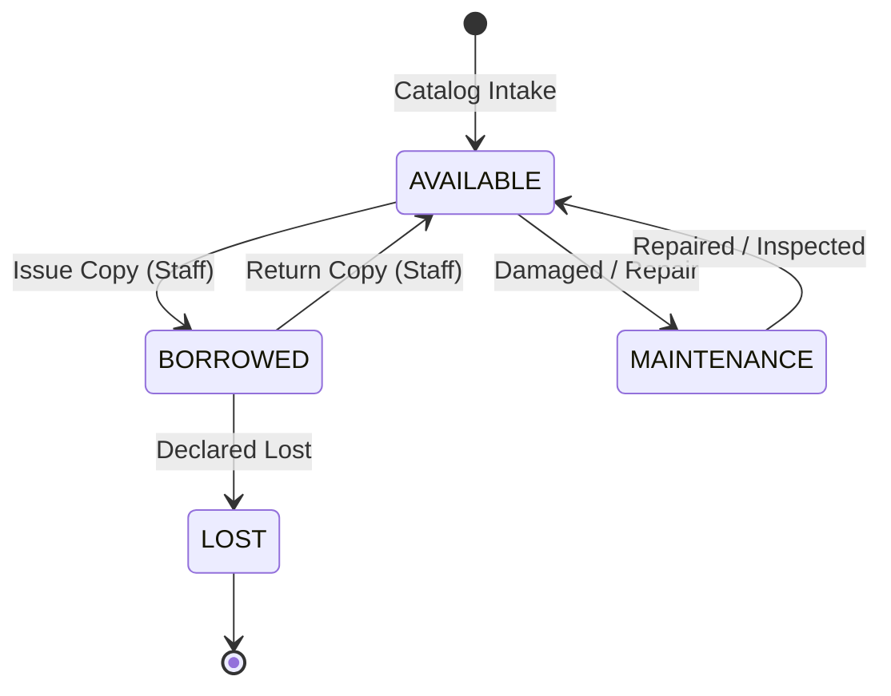
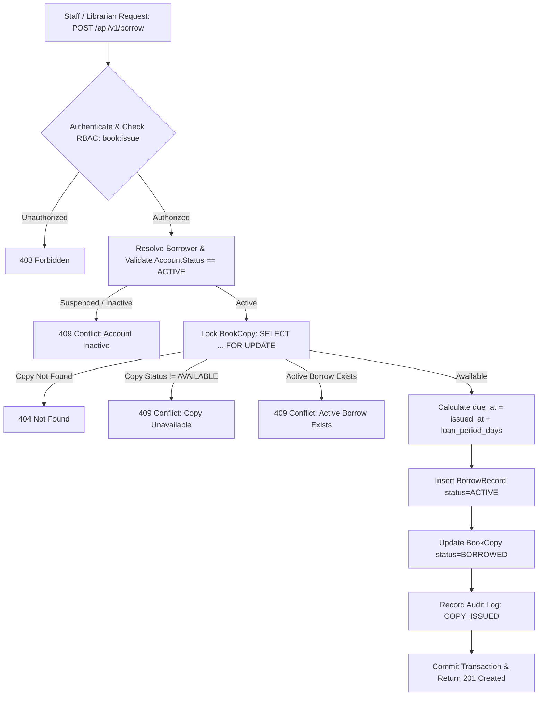

# PustakHub — Circulation, Borrowing & Fines Architecture

This document specifies the design, operational workflows, concurrency guarantees, and security policies governing the **Circulation, Borrowing, and Fines Module** in PustakHub.

---

## 1. Domain Model and Relationships

PustakHub manages library inventory through a clear separation between conceptual bibliographic metadata (`Book`) and specific inventory items (`BookCopy`).

```
User (Member / Staff)
  │
  └── BorrowRecord (Circulation Transaction)
          │
          ├── BookCopy (Physical Unit with Barcode/Identifier)
          │       │
          │       └── Book (Bibliographic Title / ISBN)
          │
          └── Fine (Late Return / Overdue Penalty)
```

### Entity State Definitions

| Model | Key Fields | Invariants & Constraints |
| :--- | :--- | :--- |
| **`BookCopy`** | `id`, `book_id`, `copy_identifier`, `status`, `shelf_location` | `status` in `[AVAILABLE, BORROWED, MAINTENANCE, LOST]`. At most 1 active `BorrowRecord` per physical copy. |
| **`BorrowRecord`** | `id`, `user_id`, `book_copy_id`, `issued_at`, `due_at`, `returned_at`, `status` | Active records have `returned_at IS NULL` and `status = ACTIVE`. Returned records have `returned_at IS NOT NULL` and `status = RETURNED`. |
| **`Fine`** | `id`, `user_id`, `borrow_record_id`, `amount`, `reason`, `status` | Unique 1:1 relation with `BorrowRecord`. `amount >= 0.00`. `reason = OVERDUE`. `status = PENDING`. |

---

## 2. Circulation Policy & Defaults

Circulation rules are centrally defined in `app.core.config.Settings`:

- **Default Loan Period:** `14 days` (`DEFAULT_LOAN_PERIOD_DAYS = 14`).
  - Staff may override the loan duration per issue request (`loan_period_days`).
- **Daily Late Fine Rate:** `$2.00 / day` (`DAILY_FINE_RATE = 2.00`).
- **Max Concurrent Borrows per User:** `5 active items` (`MAX_ACTIVE_BORROWS_PER_USER = 5`).
- **Timezone Standard:** All timestamps (`issued_at`, `due_at`, `returned_at`, `created_at`) are stored in **UTC (ISO-8601)**.

---

## 3. Physical Inventory State Transitions



### State Transition Validation Matrix

| Target State | Initial State: AVAILABLE | Initial State: BORROWED | Initial State: MAINTENANCE | Initial State: LOST |
| :--- | :--- | :--- | :--- | :--- |
| **Issue (`BORROWED`)** | **Allowed** | `409 Conflict` (Already borrowed) | `409 Conflict` (In repair bay) | `409 Conflict` (Marked lost) |
| **Return (`AVAILABLE`)** | `409 Conflict` (No active loan) | **Allowed** | `409 Conflict` | `409 Conflict` |

---

## 4. Book Issue Workflow



---

## 5. Book Return Workflow & Overdue Fine Calculation

```mermaid
flowchart TD
    A[Staff / Librarian Request: POST /api/v1/borrow/{borrow_id}/return] --> B{Authenticate & Check RBAC: book:return}
    B -->|Unauthorized| C[403 Forbidden]
    B -->|Authorized| D[Lock BorrowRecord: SELECT ... FOR UPDATE]
    D -->|Not Found| E[404 Not Found]
    D -->|status != ACTIVE or returned_at != NULL| F[409 Conflict: Already Returned]
    D -->|Active| G[Lock BookCopy & Set returned_at timestamp]
    G --> H{returned_at > due_at ?}
    H -->|No: On Time| I[No Fine Generated]
    H -->|Yes: Overdue| J["Calculate Overdue Days: ceil(delta / 86400s)"]
    J --> K["Calculate Fine: overdue_days * DAILY_FINE_RATE"]
    K --> L[Insert Fine record: reason=OVERDUE, status=PENDING]
    L --> M[Record Audit Log: FINE_ISSUED]
    I --> N[Update BookCopy status=AVAILABLE]
    M --> N
    N --> O[Update BorrowRecord status=RETURNED]
    O --> P[Record Audit Log: COPY_RETURNED]
    P --> Q[Commit Transaction & Return 200 OK]
```

### Deterministic Overdue Formula
$$\text{overdue\_seconds} = (\text{returned\_at} - \text{due\_at}).\text{total\_seconds}()$$
$$\text{overdue\_days} = \max\left(1, \left\lceil \frac{\text{overdue\_seconds}}{86400} \right\rceil\right)$$
$$\text{fine\_amount} = \text{overdue\_days} \times \text{DAILY\_FINE\_RATE}$$

---

## 6. Concurrency and Row-Level Locking

To prevent race conditions where two simultaneous requests issue the same physical book copy:

1. **Pessimistic Row Lock (`SELECT ... FOR UPDATE`):**
   - The database transaction acquires an exclusive row lock on the target `BookCopy` row before checking availability.
   - Any concurrent issue request blocks until the first transaction commits or aborts.
   - When the second transaction acquires the lock, it reads `status = BORROWED` and immediately returns `409 Conflict`.
2. **Atomicity:**
   - Both the creation of `BorrowRecord` and the status change of `BookCopy` are committed in the same database transaction.
   - Failures (e.g., audit logging exceptions) trigger a rollback to maintain database consistency.

---

## 7. RBAC & Resource-Level Authorization (IDOR / BOLA Prevention)

### Permission Mapping

| Endpoint | Method | Required RBAC Permission | Resource Scoping Rules |
| :--- | :--- | :--- | :--- |
| `/api/v1/borrow` | `POST` | `book:issue` | Staff only (Librarian, Admin). |
| `/api/v1/borrow/{borrow_id}/return` | `POST` | `book:return` | Staff only (Librarian, Admin). |
| `/api/v1/borrowings` | `GET` | `book:view` | Students can only query their own borrowings. Staff can filter by any user. |
| `/api/v1/borrowings/{borrow_id}` | `GET` | `book:view` | Student can only view if `record.user_id == current_user.id`. Staff can view all. |
| `/api/v1/users/{user_id}/borrowings` | `GET` | `book:view` | Student can only access if `user_id == current_user.id`. Staff can access any user. |
| `/api/v1/fines` | `GET` | `book:view` | Students can only query their own fines. Staff can filter by any user. |
| `/api/v1/fines/{fine_id}` | `GET` | `book:view` | Student can only view if `fine.user_id == current_user.id`. Staff can view all. |
| `/api/v1/users/{user_id}/fines` | `GET` | `book:view` | Student can only access if `user_id == current_user.id`. Staff can access any user. |

---

## 8. Audit Logging & Security Guarantees

All circulation operations emit structured audit logs to the `audit_logs` table:

- `COPY_ISSUED`: Emitted upon successful book copy loan.
- `COPY_RETURNED`: Emitted upon copy check-in.
- `FINE_ISSUED`: Emitted automatically when an overdue copy return generates a fine penalty.

### Data Privacy & Secret Shielding
- Audit entries record `actor_id`, `resource_type`, `resource_id`, `ip_address`, and `user_agent`.
- **Zero Secrets Recorded:** No JWT tokens, passwords, OTPs, or hashes are logged in audit events.
