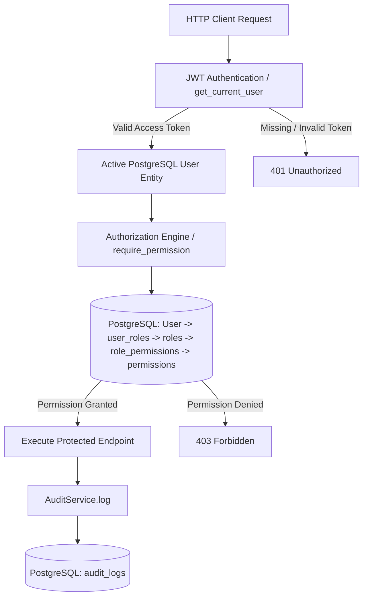
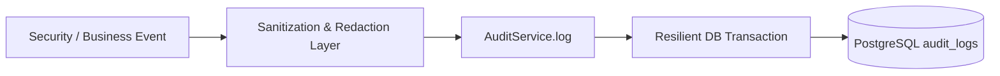

# PustakHub — Role-Based Access Control (RBAC) & Audit Logging

> **Phase 4 — Authorization & Audit Logging Infrastructure**  
> Last updated: 2026-09-24

---

## Table of Contents

1. [Architecture Overview](#1-architecture-overview)
2. [Roles & Principles](#2-roles--principles)
3. [Permission Vocabulary](#3-permission-vocabulary)
4. [Role → Permission Matrix](#4-role--permission-matrix)
5. [Authorization Dependencies](#5-authorization-dependencies)
6. [Status Semantics: 401 vs 403](#6-status-semantics-401-vs-403)
7. [Resource-Level Authorization (IDOR & BOLA Prevention)](#7-resource-level-authorization-idor--bola-prevention)
8. [Privilege Escalation Defenses](#8-privilege-escalation-defenses)
9. [Audit Logging Architecture](#9-audit-logging-architecture)
10. [Audit Event Vocabulary & Data Sanitization](#10-audit-event-vocabulary--data-sanitization)
11. [Audit Failure Policy](#11-audit-failure-policy)
12. [Anonymous & Unauthenticated Audit Logging](#12-anonymous--unauthenticated-audit-logging)
13. [Security Considerations](#13-security-considerations)
14. [Deferred Features](#14-deferred-features)

---

## 1. Architecture Overview

PustakHub implements a multi-layered, backend-enforced **Role-Based Access Control (RBAC)** architecture decoupled from authentication:



### Core Tenets
1. **Backend Authoritative:** Client headers, frontend routes, and JWT static claims are never trusted for authorization. The database state (`user_roles` and `role_permissions`) is authoritative on every request.
2. **Permission-Based, Not Role-Conditioned:** Route handlers check fine-grained permissions (e.g., `book:create`, `user:view`), not raw role names (`if user.role == "ADMIN"` is forbidden).
3. **Decoupled Lifecycle:** Roles are logical groupings of permissions. Adding new roles or adjusting existing permissions requires zero endpoint code modification.

---

## 2. Roles & Principles

PustakHub defines four primary system roles:

| Role | Concept & Scope | Public Assignability |
|---|---|---|
| `ADMIN` | Full administrative control, user lifecycle management, role & permission governance, audit inspection. | **Never.** Managed exclusively by existing administrators. |
| `LIBRARIAN` | Library staff managing catalogue, physical book copies, circulation (issue/return), and viewing user profiles. | **Never.** Assigned administratively. |
| `STUDENT` | Registered library member with book catalog browsing and self-service borrowing capabilities. | **Automatic.** Every verified public registration is assigned `STUDENT`. |
| `GUEST` | Unauthenticated public visitor with read-only catalog access. | Implicit / unauthenticated callers. |

---

## 3. Permission Vocabulary

Permissions follow the canonical `resource:action` format, with uppercase alias normalization supported (`BOOK_VIEW` $\rightarrow$ `book:view`).

| Permission | Canonical Name | Description |
|---|---|---|
| `BOOK_VIEW` | `book:view` | View book catalogue, details, and availability. |
| `BOOK_CREATE` | `book:create` | Add new titles and book metadata to the catalogue. |
| `BOOK_UPDATE` | `book:update` | Modify existing book metadata and descriptions. |
| `BOOK_DELETE` | `book:delete` | Remove book titles from the catalogue. |
| `BOOK_ISSUE` | `book:issue` | Issue physical book copies to library members. |
| `BOOK_RETURN` | `book:return` | Process book copy returns and check-ins. |
| `USER_VIEW` | `user:view` | View user accounts, profiles, and account statuses. |
| `USER_CREATE` | `user:create` | Administratively create user accounts. |
| `USER_UPDATE` | `user:update` | Update user profiles, account statuses, or role bindings. |
| `USER_DELETE` | `user:delete` | Deactivate or delete user accounts. |
| `ROLE_VIEW` | `role:view` | View role definitions and member assignments. |
| `ROLE_CREATE` | `role:create` | Create custom system roles. |
| `ROLE_UPDATE` | `role:update` | Update roles and manage role-permission mappings. |
| `ROLE_DELETE` | `role:delete` | Delete custom system roles. |
| `PERMISSION_VIEW` | `permission:view` | Inspect system permissions and role-permission matrix. |
| `PERMISSION_ASSIGN` | `permission:assign` | Assign or revoke permissions to/from roles. |
| `AUDIT_LOG_VIEW` | `audit_log:view` | Query and inspect security audit trail logs. |

---

## 4. Role → Permission Matrix

The default mapping seeded into PostgreSQL:

```text
┌────────────────────┬───────────┬──────────────┬───────────┬─────────┐
│ Permission         │   ADMIN   │  LIBRARIAN   │  STUDENT  │  GUEST  │
├────────────────────┼───────────┼──────────────┼───────────┼─────────┤
│ book:view          │     ✓     │      ✓       │     ✓     │    ✓    │
│ book:create        │     ✓     │      ✓       │     ✗     │    ✗    │
│ book:update        │     ✓     │      ✓       │     ✗     │    ✗    │
│ book:delete        │     ✓     │      ✓       │     ✗     │    ✗    │
│ book:issue         │     ✓     │      ✓       │     ✗     │    ✗    │
│ book:return        │     ✓     │      ✓       │     ✗     │    ✗    │
│ user:view          │     ✓     │      ✓       │     ✗     │    ✗    │
│ user:create        │     ✓     │      ✗       │     ✗     │    ✗    │
│ user:update        │     ✓     │      ✗       │     ✗     │    ✗    │
│ user:delete        │     ✓     │      ✗       │     ✗     │    ✗    │
│ role:view          │     ✓     │      ✗       │     ✗     │    ✗    │
│ role:create        │     ✓     │      ✗       │     ✗     │    ✗    │
│ role:update        │     ✓     │      ✗       │     ✗     │    ✗    │
│ role:delete        │     ✓     │      ✗       │     ✗     │    ✗    │
│ permission:view    │     ✓     │      ✗       │     ✗     │    ✗    │
│ permission:assign  │     ✓     │      ✗       │     ✗     │    ✗    │
│ audit_log:view     │     ✓     │      ✓       │     ✗     │    ✗    │
└────────────────────┴───────────┴──────────────┴───────────┴─────────┘
```

---

## 5. Authorization Dependencies

FastAPI dependencies encapsulate all authorization logic cleanly at the routing layer:

### `require_permission(permission_name: str)`
Enforces that the caller holds the exact permission:
```python
@router.get("/roles", dependencies=[Depends(require_permission("role:view"))])
def list_roles():
    ...
```

### `require_any_permission(*permissions: str)`
Enforces that the caller possesses at least one of the specified permissions:
```python
@router.post("/users/{user_id}/roles", dependencies=[Depends(require_any_permission("role:update", "user:update"))])
def assign_role():
    ...
```

### `require_all_permissions(*permissions: str)`
Enforces that the caller possesses all listed permissions.

### `require_role(role_name: str)`
Ensures the caller has a specific named role (used only when role identity itself is mandatory).

---

## 6. Status Semantics: 401 vs 403

PustakHub strictly differentiates between unauthenticated callers and unauthorized actions:

| HTTP Status | Meaning | Condition | Example |
|---|---|---|---|
| `401 Unauthorized` | Identity unverified or credentials missing | Missing Bearer token, expired JWT, signature mismatch, revoked session, inactive user. | Requesting `/api/v1/permissions` with no `Authorization` header. |
| `403 Forbidden` | Identity verified but insufficient privilege | Authenticated user lacks the required permission or does not own the requested resource. | A `STUDENT` attempting to call `GET /api/v1/audit/logs`. |

---

## 7. Resource-Level Authorization (IDOR & BOLA Prevention)

Route-level checks verify *whether* a user can execute an action. Resource-level checks verify *which specific object* the user can access.

### Prevention Logic:
```python
def check_resource_access(
    current_user: User,
    resource_owner_id: uuid.UUID,
    admin_permission: str = "user:view",
    db: Optional[Session] = None,
) -> bool:
    # 1. Owner can always access their own resource
    if current_user.id == resource_owner_id:
        return True

    # 2. Administrative override if caller holds the corresponding permission
    if db is not None:
        return permission_service.user_has_permission(current_user, admin_permission, db)

    return False
```

### Protection Guarantee:
- Student A accessing `/users/<Student_A_UUID>` $\rightarrow$ **200 OK**
- Student A accessing `/users/<Student_B_UUID>` $\rightarrow$ **403 Forbidden**
- Admin accessing `/users/<Student_B_UUID>` $\rightarrow$ **200 OK** (via `user:view` permission)

---

## 8. Privilege Escalation Defenses

1. **Role Injection Immunity:** Request payloads cannot define role attributes during registration or profile updates.
2. **Immutable Role Assignment:** Public registration exclusively provisions `STUDENT` server-side upon OTP verification.
3. **Permission Tampering Protection:** Dynamic permissions are resolved directly from database joins on `user_roles` $\leftrightarrow$ `role_permissions`.
4. **Token Claim Disregard:** JWT access tokens store only the subject (`sub: user_id`). No authorization decisions are made from untrusted or stale token payload claims.
5. **No Frontend Reliance:** Frontend UI route guards (`ProtectedRoute`) enhance user experience only; all access controls are strictly executed server-side.

---

## 9. Audit Logging Architecture

PustakHub utilizes the immutable `AuditLog` entity from Phase 2:



### Persisted Fields:
- `id` (UUID Primary Key)
- `user_id` (Actor UUID, nullable for anonymous events)
- `action` (`AuditAction` enum)
- `resource_type` (Entity name, e.g., `'User'`, `'Role'`)
- `resource_id` (Safe resource identifier)
- `status` (`AuditStatus` enum: `SUCCESS`, `FAILURE`, `PARTIAL`)
- `timestamp` (UTC datetime, set by DB on insert)
- `ip_address` (Client IP)
- `user_agent` (Client User-Agent string)

---

## 10. Audit Event Vocabulary & Data Sanitization

### Monitored Events:
- `USER_CREATED`: New student account provisioned via OTP verification.
- `LOGIN_SUCCESS`: Successful credential verification and session issuance.
- `LOGIN_FAILURE`: Invalid password, unknown email, or suspended account login attempt.
- `LOGOUT`: Session revoked and invalidated on server.
- `TOKEN_REFRESH`: Refresh token rotated and new session established.
- `ROLE_ASSIGNED` / `ROLE_REVOKED`: User role modifications.
- `PERMISSION_GRANTED` / `PERMISSION_REVOKED`: Role permission changes.

### Data Sanitization:
The audit layer strictly enforces that sensitive data is **never stored or logged**:
- No plaintext passwords or Argon2id hashes.
- No OTP codes or OTP digests.
- No raw JWT access or refresh tokens.
- No database or service connection strings.
Any string matching sensitive patterns is automatically sanitized to `[REDACTED_SENSITIVE_DATA]`.

---

## 11. Audit Failure Policy

**Resilient Fail-Safe Policy (Fail-Open for Non-Critical Operations):**
- In the event of a transient database error during audit logging, the error is immediately logged to stderr via Python's `logging` system.
- For standard user requests (e.g., login, registration), an audit failure will not crash the primary user workflow.
- A `strict=True` parameter is available for high-security administrative workflows requiring strict transactional non-repudiation.

---

## 12. Anonymous & Unauthenticated Audit Logging

Unauthenticated security events (e.g. failed login attempts for non-existent users or unauthorized scanner probes) maintain `user_id = NULL`.

The application never manufactures dummy user UUIDs for anonymous events, preserving relational integrity with `users.id`.

---

## 13. Security Considerations

- **Session Invalidation:** Revoked refresh tokens immediately prevent future access token renewals.
- **Timing Attack Mitigation:** Authentication against nonexistent emails evaluates a dummy Argon2id hash to normalize response latency.
- **Index Optimization:** Indexes on `(user_id, timestamp)`, `action`, and `(resource_type, resource_id)` ensure high-speed forensic queries without table scans.

---

## 14. Future Enhancements & Scope

Phases 5 through 9 completed the core platform capabilities (Catalog CRUD, Inventory Copies, Row-Locked Borrowing, Overdue Fines, Encrypted MFA, Sliding-Window Rate Limiting, and Security Headers).

Potential future authorization enhancements include:
- Time-bound temporary role grants
- Attribute-Based Access Control (ABAC) policies (e.g. department or branch location scoping)
- Fine payment gateway authorization
- Hierarchical role inheritance structures
