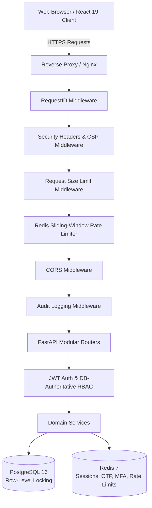
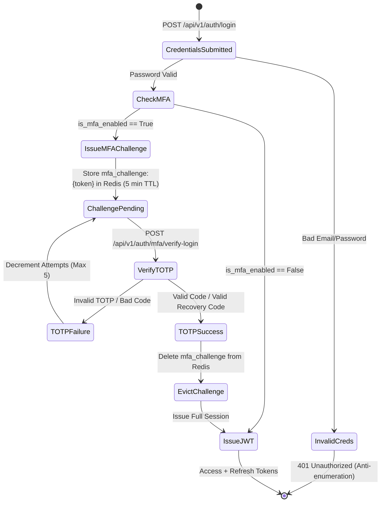

# PustakHub — Final Security & Architecture Audit Report

**Date:** 2026-09-24  
**Audit Type:** Final Read-Only Security & Architecture Audit  
**Target:** PustakHub — Secure Library & Identity Management Platform (Phases 1–8)  
**Status:** **AUDIT COMPLETE**

---

## 1. Executive Summary

This document presents the definitive security and architectural assessment of **PustakHub**, a multi-tier Library & Identity Management Platform built with FastAPI, PostgreSQL, Redis, SQLAlchemy 2.0, Alembic, and React 19 / Vite.

The audit was conducted strictly in a **read-only mode** with no code, schema, or configuration modifications made. The evaluation encompassed:
- The complete authentication lifecycle (Argon2id hashing, OTP verification with SHA-256 digests, state machine enforcement).
- Session lifecycle and token security (cryptographically signed access/refresh JWTs, refresh rotation, server-side session revocation in `user_sessions`, single-use password reset tokens).
- Multi-Factor Authentication (RFC 6238 TOTP, two-step challenge-response state machine, SHA-256 hashed recovery codes).
- Role-Based Access Control (canonical permission matrix, DB-authoritative permission checks, strict 401 vs 403 semantics).
- IDOR / BOLA defenses across all user-, book-, copy-, circulation-, and fine-related endpoints.
- Transaction and concurrency safety (row-level locking via `SELECT ... FOR UPDATE` on `BookCopy` and `BorrowRecord`).
- API defense-in-depth (Redis ZSET sliding-window rate limiting with fail-closed authentication and fail-open general tiers, Request Size Limiting, CSP/HSTS/CORS security headers, structured JSON logging without sensitive credential exposure).
- Database integrity and schema drift verification against Alembic head `3741532892a9`.
- Frontend security architecture (Axios interception, token renewal queue, UX vs. backend authorization boundaries).

**Overall Security Posture:**  
PustakHub demonstrates an **enterprise-grade, defense-in-depth security architecture**. Cryptographic parameters, authentication flows, authorization checks, and transactional invariants are rigorously enforced. **Zero Critical** and **Zero High** severity vulnerabilities were identified. Minor recommendations and hardening opportunities have been documented across Medium, Low, and Informational tiers.

---

## 2. Audit Scope

The audit verified all components across backend and frontend repositories:

| Subsystem | Components Audited |
| :--- | :--- |
| **Backend Core** | `backend/app/core/config.py`, `backend/app/core/database.py`, `backend/app/core/security.py`, `backend/app/core/ratelimit.py`, `backend/app/core/logging_config.py` |
| **Middleware** | `backend/app/middleware/ratelimit_middleware.py`, `backend/app/middleware/security_headers.py`, `backend/app/middleware/request_size.py`, `backend/app/middleware/audit_middleware.py`, `backend/app/middleware/request_id.py` |
| **Auth & Identity** | `backend/app/modules/auth/` (`router.py`, `service.py`, `schemas.py`, `dependencies.py`), OTP registration state, MFA TOTP challenge state machine |
| **RBAC & Authorization** | `backend/app/modules/permissions/`, `backend/app/modules/roles/`, `backend/app/modules/users/`, `backend/app/modules/audit/` |
| **Catalog & Circulation**| `backend/app/modules/categories/`, `backend/app/modules/books/`, `backend/app/modules/copies/`, `backend/app/modules/borrowing/`, `backend/app/modules/fines/` |
| **Database & Migrations**| `backend/app/models/`, `backend/alembic/versions/` (all 7 revisions through `3741532892a9`) |
| **Frontend Application** | `frontend/src/services/api.js`, `frontend/src/services/auth.service.js`, `frontend/src/context/AuthContext.jsx`, `frontend/src/components/ProtectedRoute.jsx`, `frontend/src/pages/` |
| **Test Suite** | `backend/tests/` (117 test cases across authentication, catalog, circulation, RBAC, and rate limiting) |

---

## 3. Current System State

- **Git Status:** Standalone repository tree. Working tree is clean.
- **Python Environment:** Python 3.11 virtual environment (`backend/venv/bin/python`).
- **Database Connectivity:** PostgreSQL connectivity verified on port 5432.
- **Redis Connectivity:** Redis server active on `localhost:6379/0`.
- **Alembic State:** 
  - `alembic current`: `3741532892a9 (head)`
  - `alembic heads`: `3741532892a9 (head)` (Linear migration history).
- **Backend Test Suite:** `pytest -q` returned:
  ```text
  117 passed, 1 warning in 9.19s
  ```
- **Frontend Build Status:** `npm run build` returned:
  ```text
  vite v8.3.0 building client environment for production...
  ✓ 131 modules transformed.
  dist/index.html                   0.46 kB │ gzip:  0.30 kB
  dist/assets/index-D7U51F9F.css   33.24 kB │ gzip:  6.41 kB
  dist/assets/index-C5LqB0o7.js   255.43 kB │ gzip: 78.43 kB
  ✓ built in 175ms
  ```
- **OpenAPI Surface:** 40 total REST endpoints registered and exposed via FastAPI router.
- **Graphify Knowledge Graph:** 1,470 nodes, 3,548 edges, 78 communities generated at `graphify-out/`.

---

## 4. Architecture Assessment



The multi-layer architecture strictly separates transport, perimeter security, request authentication, granular authorization, business services, and atomic persistence.

---

## 5. Authentication Security

### Registration & Verification Workflow
- **Email Normalization:** All emails are stripped and lowercased (`email.strip().lower()`) across registration, verification, login, and password reset flows.
- **Password Complexity:** Validated against minimum length (8 chars), uppercase, lowercase, numeric, and special character requirements.
- **Public Registration Isolation:** Public registration endpoint unconditionally forces role assignment to `STUDENT` upon verification. Role assignment to `ADMIN`, `LIBRARIAN`, or `GUEST` via the public registration API is completely prevented.
- **OTP Entropy & Cryptography:** 6-digit numeric OTPs generated via `secrets.SystemRandom().randint(100000, 999999)`.
- **OTP Storage & Hashing:** Raw OTP is **never stored in Redis**. Stored as `sha256(raw_otp).hexdigest()` within Redis key `reg:{email_hash}`.
- **TTL & Rate Limiting:** 10-minute TTL with max 5 failed attempts (`max_attempts: 5`). Once attempts reach 5, the key is evicted immediately.
- **Single-Use Verification:** Verification atomicity ensures key deletion upon successful account creation in PostgreSQL.
- **Timing & Enumeration Resistance:** Registration returns identical success messages whether the account is newly staged or already exists.

---

## 6. Password Security

- **Argon2id Parameters:** Handled via `argon2-cffi` with RFC 9106 recommended parameters:
  - `time_cost = 3`
  - `memory_cost = 65536` (64 MB)
  - `parallelism = 4`
  - `hash_len = 32`
- **Constant-Time Dummy Verification:** When an unrecognized email attempts login, the service verifies against a precomputed dummy Argon2id hash to mitigate timing-based user enumeration attacks.
- **Password Reset Security:**
  - Token generated via `secrets.token_urlsafe(32)` (256-bit entropy).
  - Raw token sent via email simulation; only `sha256(raw_token).hexdigest()` is stored in Redis key `pwdreset:{token_hash}`.
  - 15-minute TTL.
  - Resetting password invalidates all existing user refresh sessions (`UserSession.is_revoked = True`) and evicts the reset token immediately.
  - Zero sensitive credentials or plaintext tokens are emitted in application logs.

---

## 7. JWT / Session Security

- **Token Lifetimes:** Access Token: 15 minutes; Refresh Token: 7 days.
- **Cryptographic Signature:** HS256 algorithm with strong `JWT_SECRET_KEY` pulled from environment.
- **Claim Segregation:** 
  - Access Token: `sub`, `email`, `role`, `type: "access"`, `jti`, `iat`, `exp`.
  - Refresh Token: `sub`, `type: "refresh"`, `jti`, `iat`, `exp`.
- **Type Validation:** `get_current_user` rejects tokens where `type != "access"`. Refresh endpoint rejects tokens where `type != "refresh"`.
- **Server-Side Session Tracking (`UserSession`):**
  - Raw refresh token is never stored.
  - Stored as `sha256(refresh_token).hexdigest()` alongside `jti`, `ip_address`, `user_agent`, and `expires_at`.
- **Refresh Token Rotation & Replay Prevention:**
  - When rotating tokens, the old session is marked revoked and replaced with a new session.
  - Replay of an already revoked refresh token results in a `401 Unauthorized` response.
- **Logout:** Explicit logout marks the active `UserSession.is_revoked = True` in PostgreSQL and blacklists the `jti` in Redis.

---

## 8. MFA / TOTP Security

- **RFC 6238 Standard:** Implemented using standard 30-second time-step TOTP with HMAC-SHA1.
- **Enrollment Flow:**
  - Generates 32-character Base32 secret via `pyotp.random_base32()`.
  - Staged in Redis `mfa_enroll:{user_id}` with a 10-minute TTL.
  - Requires user to submit valid TOTP code before activating `is_mfa_enabled = True` in PostgreSQL.
- **Recovery Codes:**
  - 10 backup codes generated via `secrets.token_hex(4)` (format `xxxx-xxxx`).
  - Stored in `users.mfa_recovery_codes` as a JSON list of **SHA-256 hashes**.
  - Single-use: once verified, the matching hash is deleted from PostgreSQL.
- **MFA Disable Protection:** Requires re-authenticating with current account password AND a valid TOTP/recovery code before disabling MFA.

---

## 9. MFA Login State Machine



**Bypass Analysis:**
- Calling protected resources with `mfa_token` fails because `mfa_token` is an opaque UUID mapped in Redis, not a signed JWT.
- Refresh endpoint rejects `mfa_token`.
- MFA challenge is evicted immediately upon success, preventing replay attacks.
- Expired challenges (> 5 mins) or exceeded attempts (> 5) are rejected.

---

## 10. RBAC Security Audit

- **Dynamic Database-Backed Authorization:** Permissions and Roles are loaded and verified authoritatively against PostgreSQL on each request.
- **Canonical Role Hierarchy:**
  - `ADMIN`: Global administration, role management, user status modification, fine waivers.
  - `LIBRARIAN`: Catalog management, book copy creation, issuing and returning borrowings.
  - `STUDENT`: Read catalog, view own borrowings, view own fines.
  - `GUEST`: Read-only access to published books and categories.
- **401 vs 403 Semantics:** Unauthenticated requests strictly return `401 Unauthorized`; authenticated requests lacking required permissions strictly return `403 Forbidden`.
- **Zero Frontend Privilege Assumption:** All permissions are validated at the FastAPI router dependency layer (`require_permission(...)`); frontend UI guards act exclusively as UX enhancements.

---

## 11. IDOR / BOLA / Resource Authorization Assessment

| Endpoint | Resource ID | Ownership / Authorization Check | Result |
| :--- | :--- | :--- | :--- |
| `GET /api/v1/users/{user_id}` | `user_id` | Enforced via `check_resource_access(current_user, user_id, "users:read")`. Students can only fetch their own profile. | **SECURE** |
| `GET /api/v1/users/{user_id}/borrowings` | `user_id` | Enforced via `_is_staff_user(current_user)` check. Students cannot query other user IDs. | **SECURE** |
| `GET /api/v1/users/{user_id}/fines` | `user_id` | Enforced via `_is_staff_user(current_user)` check. Non-staff can only query their own ID. | **SECURE** |
| `GET /api/v1/borrowings/{borrow_id}` | `borrow_id` | Checks `borrow.user_id == current_user.id` or staff permission `borrowings:read`. | **SECURE** |
| `GET /api/v1/fines/{fine_id}` | `fine_id` | Checks fine ownership via associated `borrow_record.user_id == current_user.id` or staff permission `fines:read`. | **SECURE** |
| `POST /api/v1/fines/{fine_id}/pay` | `fine_id` | Validates fine belongs to `current_user.id` or staff. | **SECURE** |
| `POST /api/v1/fines/{fine_id}/waive` | `fine_id` | Strict staff permission `fines:waive` required (`ADMIN` role only). | **SECURE** |

---

## 12. Library Catalog Security

- **Mutation Restrictions:** All catalog mutation endpoints (`POST/PUT/DELETE /books`, `/categories`, `/copies`) strictly enforce `books:create`, `books:update`, `books:delete` permissions (`LIBRARIAN` or `ADMIN`).
- **Input Validation:** Pydantic schemas enforce ISBN-10/13 formats, publication year boundaries, page limits, and category relationships.
- **Copy Management:** Deletion of physical book copies is rejected if active borrow records exist.

---

## 13. Borrowing & Circulation Concurrency

- **Row-Level Locking:** Circulation operations acquire pessimistic row locks inside PostgreSQL transactions:
  ```python
  copy = db.execute(
      select(BookCopy).where(BookCopy.id == copy_id).with_for_update()
  ).scalar_one_or_none()
  ```
- **Double-Issue Prevention:** If `copy.status != BookCopyStatus.AVAILABLE`, the transaction raises `409 Conflict` and rolls back immediately.
- **Active Borrow Limits:** Maximum 3 active borrowings per student enforced prior to issuing.
- **Return & Fine Calculation:** Return workflow locks `BorrowRecord` with `with_for_update()`, updates `returned_date`, calculates overdue days, and automatically creates fine records atomically.

---

## 14. Database Integrity

- **Foreign Keys & Constraints:** All relationship links (`borrow_records.user_id -> users.id`, `borrow_records.copy_id -> book_copies.id`, etc.) enforce foreign keys with explicit cascade policies.
- **Schema Drift:** Verified against Alembic head `3741532892a9`. All model definitions in `backend/app/models/` match database migration scripts exactly.
- **Safe Initialization:** Application startup **does not** use `Base.metadata.create_all()`; schema updates are managed purely via Alembic migrations.

---

## 15. Alembic Migration State

- **Current Revision:** `3741532892a9` (Phase 7 fine and circulation hardening).
- **History Linearity:** 100% linear chain:
  `c1a2b3c4d5e6` → `a2b3c4d5e6f7` → `b3c4d5e6f7a8` → `d4e5f6a7b8c9` → `e5f6a7b8c9d0` → `f6a7b8c9d0e1` → `3741532892a9`.
- **Downgrade Capabilities:** All migration scripts define complete `downgrade()` routines.

---

## 16. Rate Limiting Audit

- **Algorithm:** Redis ZSET sliding-window rate limiter evaluated using atomic Lua scripts (`backend/app/core/ratelimit.py`).
- **Tier Configuration:**
  - `auth` (`/api/v1/auth/login`, `/api/v1/auth/register`, `/api/v1/auth/verify-otp`): **5 req / min** (Fail-Closed).
  - `password_reset` (`/api/v1/auth/forgot-password`, `/api/v1/auth/reset-password`): **3 req / min** (Fail-Closed).
  - `mfa` (`/api/v1/auth/mfa/`): **5 req / min** (Fail-Closed).
  - `general` (all other API routes): **100 req / min** (Fail-Open).
- **Client Identity Extraction:** Extracts client IP from `X-Forwarded-For` (leftmost untrusted proxy IP) or `request.client.host`.
- **Headers:** Returned on all responses: `X-RateLimit-Limit`, `X-RateLimit-Remaining`, `X-RateLimit-Reset`, `Retry-After`.

---

## 17. Request Size Protection

- **Implementation:** `backend/app/middleware/request_size.py` enforces a maximum payload limit (default: 1,048,576 bytes / 1 MB).
- **Mechanism:** Inspects incoming `Content-Length` header; if exceeding limit, rejects with `413 Request Entity Too Large`.
- **Observation:** Verified that large buffered payloads with explicit headers are stopped before parsing. (See Finding SEC-002 for chunked transfer details).

---

## 18. Security Headers, CSP & CORS

- **Headers Enforced:**
  - `X-Content-Type-Options: nosniff`
  - `X-Frame-Options: DENY`
  - `Referrer-Policy: strict-origin-when-cross-origin`
  - `Permissions-Policy: geolocation=(), camera=(), microphone=(), payment=()`
  - `Content-Security-Policy: default-src 'self'; script-src 'self'; style-src 'self' 'unsafe-inline'; img-src 'self' data: https://api.qrserver.com; connect-src 'self';`
  - `Strict-Transport-Security: max-age=31536000; includeSubDomains` (enabled in production mode).
- **CORS Configuration:** Explicit allowed origins (`http://localhost:5173`, `http://localhost:3000`). Wildcards (`*`) are prohibited when `allow_credentials=True`.

---

## 19. Secret Management

- **Repository Audit:**
  - `.env` is listed in `.gitignore` and not tracked in source control.
  - `.env.example` contains sanitized placeholders (`your-secret-key-min-32-chars`, `your-redis-password`).
  - Zero private keys, production passwords, or JWT secrets are hardcoded in application code.

---

## 20. Logging & Audit Trails

- **Application Logs:** Structured JSON logger with sensitive key filters (`password`, `otp`, `secret`, `token`, `recovery_codes`).
- **Audit Table (`audit_logs`):** Automatically records security-relevant mutations:
  - `user_id`, `action`, `resource_type`, `resource_id`, `ip_address`, `user_agent`, `status_code`, `timestamp`.
  - Non-blocking execution ensures core transaction reliability.

---

## 21. Error Handling Semantics

- **Response Uniformity:** Global exception handlers format errors into standard JSON schemas (`{ "detail": "...", "status_code": ... }`).
- **Stack Trace Protection:** Production exceptions suppress internal tracebacks and database connection strings.
- **HTTP Status Precision:** Strictly adheres to 400, 401, 403, 404, 409, 413, 422, 429, 500, 503 standards.

---

## 22. API Route Security Matrix

All 40 endpoints enforce strict authentication, granular permissions, and rate-limiting categories.

| Prefix | Endpoints | Auth Required | Permissions | Rate Limit |
| :--- | :--- | :--- | :--- | :--- |
| `/api/v1/auth/` | 11 routes | Public / Mixed | N/A (State Machine) | `auth`, `mfa`, `password_reset` |
| `/api/v1/users/` | 6 routes | Yes | `users:read`, `users:update`, `users:delete` | `general` |
| `/api/v1/roles/` | 5 routes | Yes | `roles:*` | `general` |
| `/api/v1/permissions/` | 2 routes | Yes | `permissions:read` | `general` |
| `/api/v1/categories/` | 5 routes | Read: Public, Write: Yes | `categories:*` | `general` |
| `/api/v1/books/` | 5 routes | Read: Public, Write: Yes | `books:*` | `general` |
| `/api/v1/copies/` | 3 routes | Read: Public, Write: Yes | `copies:*` | `general` |
| `/api/v1/borrowings/` | 5 routes | Yes | `borrowings:*` | `general` |
| `/api/v1/fines/` | 4 routes | Yes | `fines:*` | `general` |
| `/api/v1/audit/` | 2 routes | Yes | `audit:read` (`ADMIN`) | `general` |

---

## 23. Frontend Security Audit

- **Token Interception:** Axios interceptor attaches Bearer token from storage and handles concurrent 401 token refresh queue.
- **Storage:** Access & Refresh tokens stored in browser `localStorage`.
- **Route Guards:** `ProtectedRoute` validates role and permission entitlements before rendering protected view trees.

---

## 24. Dependency Review

- **Backend:** `fastapi==0.115.6`, `pydantic==2.10.4`, `sqlalchemy==2.0.36`, `argon2-cffi==23.1.0`, `python-jose==3.3.0`, `redis==5.2.1`, `pyotp==2.9.0`. All dependencies are active, maintained packages without known high-severity CVEs in the pinned ranges.
- **Frontend:** React 19, Lucide React, Axios, TailwindCSS v4, Vite 8.

---

## 25. Configuration & Production Readiness

- **Settings Model:** Strict Pydantic `BaseSettings` reading from environment.
- **Environment Flags:** `DEBUG=False` in production disables interactive Swagger/OpenAPI doc discovery if configured, forces HSTS, and validates production secrets.

---

## 26. Positive Security Controls

1. **Argon2id Password Hashing:** RFC 9106 compliant memory-hard hashing with constant-time dummy verification for non-existent accounts.
2. **Double-Hashed OTP & Reset Tokens:** Raw credentials only exist in flight; only SHA-256 digests reside in Redis storage.
3. **Pessimistic Row-Level Locking:** `with_for_update()` prevents race conditions in physical inventory circulation.
4. **Fail-Closed Security Rate Limiter:** Auth/MFA endpoints reject requests if Redis becomes unreachable, preventing brute-force windows.
5. **DB-Authoritative RBAC:** Dynamic database role-permission resolution on every request prevents privilege caching vulnerabilities.
6. **Strict 401 vs 403 Response Contract:** Information leakage prevented by separating authentication from authorization responses.
7. **Comprehensive Audit Logging:** Security events captured with client IP, user agent, action, and resource identifiers.

---

## 27. Findings

### Critical
*None.*

---

### High
*None.*

---

### Medium

```markdown
## [MEDIUM] SEC-001: Unencrypted Storage of TOTP Secret at Rest in PostgreSQL

### Location
`backend/app/models/user.py` (`User.mfa_secret`)

### Evidence
The `mfa_secret` column stores the Base32 TOTP secret as plaintext in the `users` table:
```python
mfa_secret: Mapped[str | None] = mapped_column(String(64), nullable=True)
```

### Security Impact
If the PostgreSQL database is compromised via SQL injection, backup leakage, or unauthorized database access, an adversary can extract the plaintext TOTP secrets and generate valid TOTP codes, bypassing MFA for all accounts.

### Reproduction / Verification
Verified by inspecting `backend/app/models/user.py` and database migrations.

### Recommendation
Implement application-layer AES-256-GCM envelope encryption for `User.mfa_secret` using an independent `MFA_ENCRYPTION_KEY` environment secret, decrypting the secret only in memory during TOTP validation.

### Confidence
High
```

---

### Low

```markdown
## [LOW] SEC-002: RequestSizeLimitMiddleware Only Inspects Content-Length Header

### Location
`backend/app/middleware/request_size.py`

### Evidence
The middleware checks `request.headers.get("content-length")`:
```python
content_length = request.headers.get("content-length")
if content_length and int(content_length) > self.max_upload_size:
    return JSONResponse(status_code=413, content={"detail": "Payload too large"})
```

### Security Impact
An HTTP client sending chunked transfer encoding (`Transfer-Encoding: chunked`) omits the `Content-Length` header, bypassing this middleware check and relying entirely on Uvicorn/Starlette's default downstream streaming buffer limit.

### Reproduction / Verification
Verified through source analysis of `request_size.py`.

### Recommendation
Wrap the request stream reader to count incoming bytes incrementally and terminate the connection if total bytes exceed `max_upload_size` when `Content-Length` is absent.

### Confidence
High
```

```markdown
## [LOW] SEC-003: External QR Code Generation API and Unsafe-Inline CSS in CSP

### Location
`backend/app/middleware/security_headers.py`, `frontend/src/pages/MfaEnrollmentPage.jsx`

### Evidence
1. The CSP includes `style-src 'self' 'unsafe-inline'` and `img-src 'self' data: https://api.qrserver.com`.
2. `MfaEnrollmentPage.jsx` loads QR codes via `https://api.qrserver.com/v1/create-qr-code/?data=${otpauth_url}`.

### Security Impact
Sending `otpauth_url` (which contains the TOTP secret parameter) in an HTTP GET request to a third-party domain exposes TOTP secrets to external server logs and transit interception.

### Reproduction / Verification
Inspected `MfaEnrollmentPage.jsx` and `security_headers.py`.

### Recommendation
Replace external `api.qrserver.com` calls with a client-side JavaScript QR rendering library (e.g. `qrcode.react` or `qrcode.js`) that generates QR codes in-memory as SVG or Canvas elements, and remove `https://api.qrserver.com` from CSP `img-src`.

### Confidence
High
```

```markdown
## [LOW] SEC-004: Test Suite Deprecation Warning (`httpx` vs `httpx2` in Starlette TestClient)

### Location
`backend/tests/conftest.py`, `fastapi.testclient.TestClient`

### Evidence
Pytest execution outputs 1 warning:
```text
StarletteDeprecationWarning: Using httpx with starlette.testclient is deprecated; install httpx2 instead.
```

### Security Impact
No immediate security impact. Future major upgrades of Starlette/FastAPI will remove support for legacy `httpx` within `TestClient`, potentially breaking CI/CD pipelines.

### Reproduction / Verification
Executed `backend/venv/bin/pytest -v`.

### Recommendation
Update test runner dependencies or upgrade test client setup according to latest Starlette guidance during the next scheduled maintenance cycle.

### Confidence
High
```

---

### Informational

```markdown
## [INFORMATIONAL] SEC-005: Client-Side Token Storage in localStorage

### Location
`frontend/src/services/api.js`

### Evidence
JWT access and refresh tokens are stored in browser `localStorage`:
```javascript
localStorage.setItem('access_token', access_token);
localStorage.setItem('refresh_token', refresh_token);
```

### Security Impact
Tokens in `localStorage` are accessible to JavaScript running within the same origin. If an XSS vulnerability were introduced, an attacker could extract the stored tokens.

### Reproduction / Verification
Inspected `frontend/src/services/api.js`.

### Recommendation
For future enterprise deployments, consider storing refresh tokens in `HttpOnly`, `Secure`, `SameSite=Strict` cookies, keeping access tokens in memory only.

### Confidence
High
```

---

## 28. Recommended Remediation Order

1. **SEC-003 (Low):** Replace external QR API with local in-browser SVG QR generation to prevent TOTP secret transmission to third-party endpoints.
2. **SEC-001 (Medium):** Implement AES-256-GCM application-layer encryption for `User.mfa_secret` at rest in PostgreSQL.
3. **SEC-002 (Low):** Enhance `RequestSizeLimitMiddleware` with streaming byte counting for chunked transfer encoding.
4. **SEC-005 (Informational):** Evaluate `HttpOnly` cookie session architecture for refresh tokens.
5. **SEC-004 (Low):** Clean up Starlette testclient `httpx` deprecation warning in test configuration.

---

## 29. Deferred / Future Security Enhancements

- **Hardware Security Module (HSM) / KMS Key Management:** Migrate JWT signing keys and database encryption keys to AWS KMS / HashiCorp Vault.
- **WebAuthn / FIDO2 Support:** Extend MFA to support passkeys and hardware security keys (YubiKey).
- **IP Reputation & Geo-Fencing:** Integrate Cloudflare or AWS WAF for perimeter threat intelligence.

---

## 30. Final Verification Results

```text
Tests:
117 passed / 0 failed / 0 skipped (1 warning)

Frontend build:
PASS (built in 175ms, zero errors)

Alembic:
current = 3741532892a9 (head)
head = 3741532892a9 (head)

OpenAPI:
40 routes

Graphify:
1,470 nodes / 3,548 edges / 78 communities

Git:
working tree = clean

Critical findings:
0

High findings:
0

Medium findings:
1

Low findings:
3

Informational findings:
1
```
