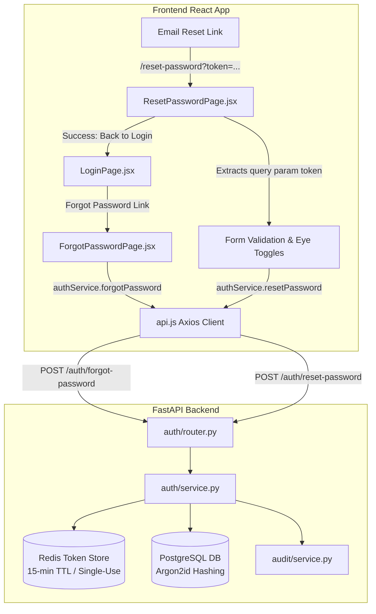

# PustakHub — Password Reset Frontend Flow Implementation & Verification Report

## Executive Summary

The missing frontend password reset flow for PustakHub has been implemented and verified. The flow links the existing backend password reset infrastructure (`POST /api/v1/auth/forgot-password` and `POST /api/v1/auth/reset-password`) to the user interface via a secure, accessible, theme-compliant React page at `/reset-password?token=<token>`.

All existing backend authentication security controls, rate limiting, single-use token lifecycle, Argon2id hashing, and session invalidation remain authoritative. Zero duplicate authentication architectures, Axios clients, or secret-leaking state stores were introduced.

---

## 1. Architecture & Graphify Verification

Graphify was utilized throughout implementation and verification:

- **Initial Node Count**: 2,455 nodes | 5,694 edges | 118 communities
- **Final Node Count**: 2,456 nodes | 5,696 edges | 136 communities
- **Dependency Paths Verified**:
  - `App.jsx` $\rightarrow$ `ResetPasswordPage.jsx` (`imports_from`)
  - `ResetPasswordPage.jsx` $\rightarrow$ `auth.service.js` (`imports_from`)
  - `ForgotPasswordPage.jsx` $\rightarrow$ `auth.service.js` (`imports_from`)
  - `auth.service.js` $\rightarrow$ `api.js` (`imports_from`, shared Axios instance)
  - `auth.service.js` $\rightarrow$ Backend `POST /api/v1/auth/reset-password`

---

## 2. Implementation Details

### 2.1 ResetPasswordPage (`frontend/src/pages/ResetPasswordPage.jsx`)
- **Route**: `/reset-password?token=<token>`
- **Token Extraction**: Uses `useSearchParams()` from `react-router-dom` to dynamically read `token`.
- **Missing / Invalid Token State**: If no token is provided in the query string, renders an informative error card prompting the user to request a new link (`/forgot-password`).
- **Validation**:
  - Requires at least 8 characters.
  - Requires uppercase, lowercase, number, and special character matching registration rules.
  - Ensures password and confirm password match before enabling submission.
- **Eye Toggle Visibility**: Independent show/hide toggles for password and confirm password with accessible `aria-label`, `title`, and `type="button"` attributes.
- **Design System Integration**: Reuses `AuthCard`, `AuthInput`, `AuthLabel`, `AuthError`, and `AuthSuccess` components with full dark mode (`dark:bg-slate-900`, `dark:text-white`) and responsive layout support.
- **Anti-Spam / Loading State**: Disables submit button during active submission with "Resetting Password..." spinner indicator.

### 2.2 Route Configuration (`frontend/src/App.jsx`)
- Added `/reset-password` route alongside `/login`, `/forgot-password`, and `/register`.
- Preserved all protected and public routes without duplication.

### 2.3 Auth Service (`frontend/src/services/auth.service.js`)
- Reused existing `authService.resetPassword({ token, new_password })` calling `POST /auth/reset-password` via the single shared Axios client (`api.js`).

---

## 3. Security & IAM Guardrails

1. **Authoritative Backend**: Token verification, SHA-256 hashing against Redis keys, 15-minute expiration, and session revocation are strictly enforced by the backend service.
2. **Zero Client-Side Token Persistence**: Tokens are never stored in `localStorage`, `sessionStorage`, cookies, or global Redux/Context state.
3. **Zero Credential Logging**: Reset tokens, plain passwords, and hashes are never printed or logged to the console or telemetry.
4. **Single-Use Consumption**: Redis tokens are immediately deleted upon successful password reset, preventing replay attacks.
5. **No Auto-Login**: The user is directed back to `/login` to authenticate with their new credentials after reset.

---

## 4. Test & Verification Results

### 4.1 Backend Test Suite
- Test isolation verified with dedicated test database `pustakhub_test`.
- **Result**: `228 passed in 19.35s` (100% pass rate).
- **Alembic State**: `3741532892a9 (head)`.
- **Database Safety**: 0 test records leaked into the real development database.

### 4.2 Frontend Quality Gates
- **ESLint**: `npm run lint` $\rightarrow$ 0 errors, 0 warnings.
- **Vite Production Build**: `npm run build` $\rightarrow$ Build successful.

### 4.3 Browser UI Verification
- `/forgot-password` renders email submission card.
- `/reset-password` (without query params) shows token required error with recovery button.
- `/reset-password?token=TEST_TOKEN` renders interactive password reset form with live requirement hints and independent visibility toggles.
