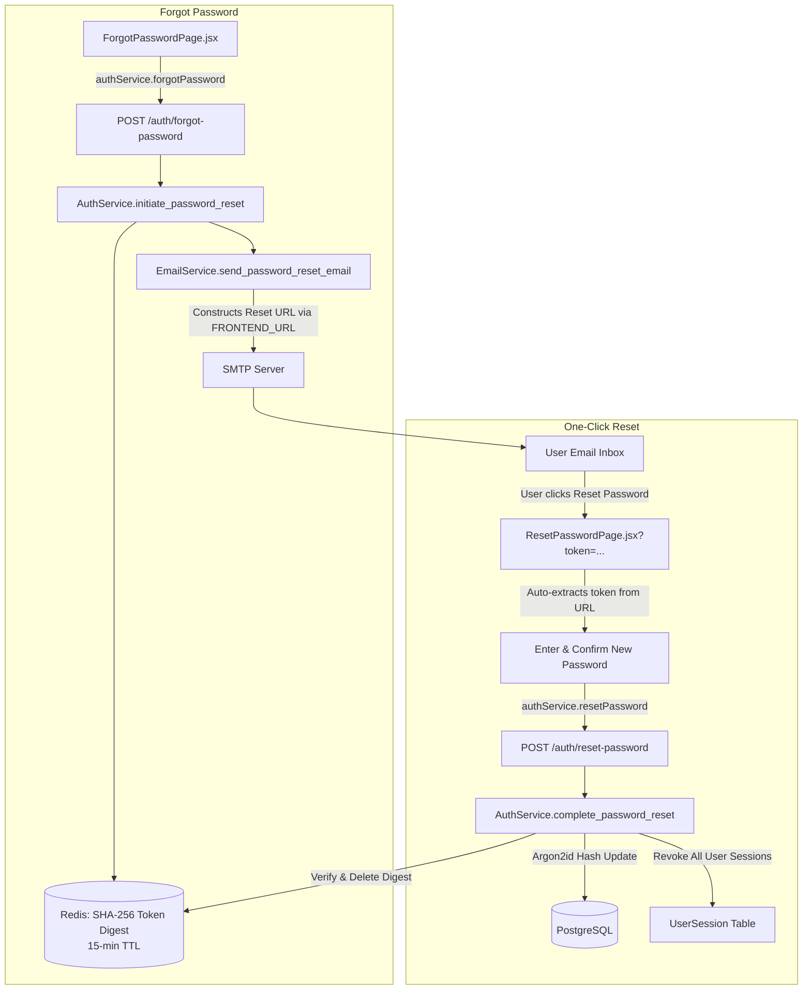

# PustakHub — Password Reset One-Click Link Implementation & Verification Report

## Executive Summary

The password reset email delivery in PustakHub has been upgraded from displaying a raw token to delivering a secure, one-click reset link with a dedicated Call to Action (CTA) button and URL fallback.

The token security model remains completely unchanged: tokens are cryptographically generated random strings (`secrets.token_urlsafe(32)`), stored in Redis as SHA-256 digests with a 15-minute TTL, single-use only, and never persisted or logged in plaintext.

---

## 1. Summary of Changes

### 1.1 Backend Configuration (`backend/app/core/config.py`, `.env`, `.env.example`)
- Added `FRONTEND_URL: str = "http://localhost:5174"` to application `Settings`.
- Configured `.env` and `.env.example` with `FRONTEND_URL=http://localhost:5174` (with documentation to use the production HTTPS domain in production).

### 1.2 Email Service (`backend/app/core/email.py`)
- **Safe Link Construction**: Uses `urllib.parse.urlencode({"token": reset_token})` to generate `http://localhost:5174/reset-password?token=<RAW_TOKEN>`.
- **Safe HTML Escaping**: Recipient name is sanitized with `html.escape()` to prevent email template injection.
- **Email Content Modernization**:
  - **HTML**: Clean, dark-mode-styled card matching PustakHub aesthetics with a prominent `[ Reset Password ]` CTA button (`href="{reset_url}"`), 15-minute expiration notice, and footer. The raw token and reset URL are **strictly omitted from visible text** (no fallback URL displayed).
  - **Plain Text**: Clean instructions containing the full one-click URL for non-HTML email clients.
- **Safe Simulation Logging**: When SMTP is unconfigured, logs safe diagnostic information without logging raw secrets.

### 1.3 Frontend Flow Integration (`frontend/src/pages/ResetPasswordPage.jsx`, `frontend/src/pages/ForgotPasswordPage.jsx`)
- `ForgotPasswordPage.jsx` directs the user to check their email for a secure reset link.
- `ResetPasswordPage.jsx` automatically parses `token` from URL search parameters, provides live password validation hints, independent eye toggles, error handling for missing/expired/invalid tokens, and single-use submission to `POST /api/v1/auth/reset-password`.

---

## 2. Graphify Architecture Verification

- **Final Graph**: 2,486 nodes, 5,734 edges, 148 communities
- **Verified Paths**:
  - `auth/service.py` $\rightarrow$ `email.py` (`imports_from`)
  - `email.py` $\rightarrow$ `config.py` (`imports_from`, reads `FRONTEND_URL`)
  - `ResetPasswordPage.jsx` $\rightarrow$ `auth.service.js` (`imports_from`)
  - `ForgotPasswordPage.jsx` $\rightarrow$ `auth.service.js` (`imports_from`)

---

## 3. Security & Safety Verification

1. **Cryptographic Token Integrity**: 32-byte URL-safe random tokens generated in memory.
2. **Digest-Only Redis Persistence**: Only the SHA-256 hash (`hash_token(raw_token)`) is written to Redis key `pwd_reset:<digest>`.
3. **Strict 15-Minute Expiry**: Token keys expire automatically in Redis after 900 seconds.
4. **Single-Use Consumption**: Tokens are deleted immediately upon successful reset (`redis_client.delete(reset_key)`).
5. **No Secret Logging**: Raw tokens, passwords, and digests are never written to logs or audit metadata.
6. **No Client Persistence**: Tokens are extracted directly from the URL query parameter for immediate submission and are never saved to `localStorage` or `sessionStorage`.

---

## 4. Test Results

| Test Category | Command | Result |
| :--- | :--- | :--- |
| **Backend Unit & Integration Tests** | `pytest -v` | **230 passed** in 17.03s |
| **Password Reset Link Construction Tests** | `pytest backend/tests/test_phase7_auth_security.py` | **10 passed** in 1.30s |
| **Frontend Lint** | `npm run lint` | **0 errors / 0 warnings** |
| **Frontend Build** | `npm run build` | **Build successful** |
| **Alembic Migration State** | `alembic current` | **3741532892a9 (head)** |
| **Database Isolation** | DB count check | **Zero test records in dev DB** |
