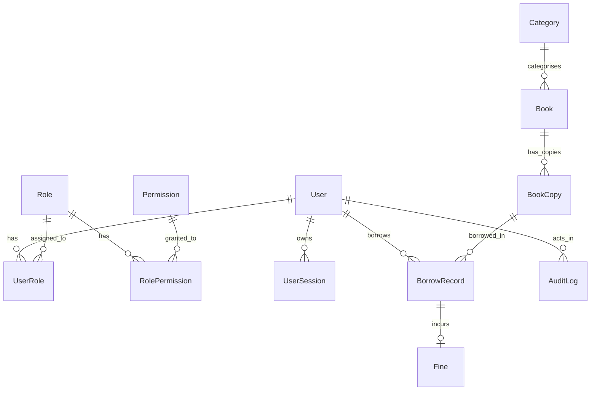

# Phase 2 Final Verification Report — PustakHub

**Status:** `VERIFIED`  
**Phase:** Phase 2 — PostgreSQL & Database Foundation  
**Platform:** PustakHub (Secure Library & Identity Management Platform)  
**Date:** 2026-09-24  
**Type:** Read-Only Verification Audit  

---

## 1. Executive Summary

A comprehensive, read-only architectural and implementation verification of **Phase 2 (PostgreSQL & Database Foundation)** was performed. All 13 verification criteria specified in the verification brief were validated against the live codebase and local PostgreSQL database instance.

* **Database & Migration Status:** Alembic migration `0438258645fa` is at `head`. All 13 tables and 53 indexes exist in the `pustakhub` PostgreSQL database.
* **Schema Integrity:** All 10 models (and 2 association tables) are defined using SQLAlchemy 2.0 declarative syntax with deterministic naming conventions and explicit foreign-key constraints.
* **Security & Secret Management:** No plaintext credentials, tokens, or passwords exist in models or configuration. Refresh tokens are represented solely by SHA-256 hashes (`token_hash`), passwords by Argon2id hash fields (`password_hash`), and `alembic.ini` contains no credentials.
* **Test Suite:** 26/26 tests passing (11 Phase 1 tests + 15 Phase 2 tests).
* **Isolation:** Zero Phase 3 authentication or business logic has been prematurely implemented.

---

## 2. Verification Checklist & Findings

| # | Verification Criterion | Status | Observations & Evidence |
|---|------------------------|--------|-------------------------|
| 1 | `DATABASE_URL` loaded from environment configuration | **PASS** | `app.core.config.Settings` uses `pydantic-settings` to load `DATABASE_URL` from `.env` or system environment. |
| 2 | PostgreSQL connection points to intended local `pustakhub` DB | **PASS** | Connection configured as `postgresql+psycopg2://sandipbiswal@localhost:5432/pustakhub` using local `trust` authentication. |
| 3 | SQLAlchemy engine, `SessionLocal`, and `get_db` correctly configured | **PASS** | `app.core.database.py` defines `engine` with `pool_pre_ping=True`, `pool_size=5`, `max_overflow=10`, `pool_recycle=1800`, `future=True`. `SessionLocal` uses `expire_on_commit=False`. `get_db` handles lifecycle with commit/rollback/close. |
| 4 | Alembic uses application database configuration | **PASS** | `migrations/env.py` dynamically injects `settings.DATABASE_URL` into Alembic context. `alembic.ini` contains only a non-credential placeholder. |
| 5 | Current migration is at `head` | **PASS** | `alembic current` confirms revision `0438258645fa (head)`. |
| 6 | No `Base.metadata.create_all()` automatic schema creation used | **PASS** | Confirmed by recursive grep search; schema is strictly managed via Alembic migrations. |
| 7 | All Phase 2 models imported for Alembic discovery | **PASS** | `app/models/__init__.py` imports all models in dependency order and exposes `__all__`. `migrations/env.py` imports `app.models`. |
| 8 | Model relationships correctly defined | **PASS** | All 10 entities and 2 association tables have explicit relationship mappings with appropriate delete cascades (`CASCADE`, `RESTRICT`, `SET NULL`). |
| 9 | Refresh tokens stored as hashes | **PASS** | `UserSession.token_hash` is `String(64)` storing SHA-256 hex digests with unique index. No raw refresh tokens are persisted. |
| 10 | No plaintext secrets in Phase 2 code | **PASS** | `User.password_hash` is nullable `Text` for Argon2id. `AuditLog` explicitly excludes secrets. `DATABASE_URL` is masked from logs and API health checks. |
| 11 | `.env` location intentional and consistent | **PASS** | `backend/.env` is ignored by root `.gitignore`. `backend/.env.example` provides a sanitized template. |
| 12 | Phase 1 functionality and tests remain intact | **PASS** | Health endpoint, root endpoint, CORS middleware, error handlers, and all 11 Phase 1 tests pass cleanly. |
| 13 | No accidental Phase 3 logic implemented | **PASS** | `app/modules/*` directories contain only placeholder stub packages. No auth routes, JWT signing, or business services exist. |

---

## 3. Files Inspected

### Configuration & Core Layer
* `backend/app/core/config.py` — Pydantic Settings class with environment variable parsing.
* `backend/app/core/database.py` — Engine creation, sessionmaker, `get_db` generator, and `check_database_connection()`.
* `backend/app/core/logging.py` — Logging configuration.
* `backend/app/core/exceptions.py` — Global exception handlers.
* `backend/app/main.py` — FastAPI application factory, lifespan context, root, and health endpoints.
* `backend/.env` — Local environment variables file.
* `backend/.env.example` — Template environment variables file.
* `.gitignore` — Root Git ignore file confirming `.env` exclusion.

### Migrations
* `backend/alembic.ini` — Alembic CLI configuration (no credentials stored).
* `backend/migrations/env.py` — Alembic runner using `settings.DATABASE_URL` and `Base.metadata`.
* `backend/migrations/versions/0438258645fa_initial_schema.py` — Complete initial schema migration.

### Domain Models (`backend/app/models/`)
* `base.py` — Declarative `Base` with naming conventions and `TimestampMixin` (`created_at`, `updated_at`).
* `__init__.py` — Package export registry importing all entities in dependency order.
* `user.py` — `User` entity, `AccountStatus` enum, email unique constraint, indexes.
* `role.py` — `Role` entity, `user_roles` and `role_permissions` M2M association tables.
* `permission.py` — `Permission` entity with unique permission name format (`resource:action`).
* `session.py` — `UserSession` entity with `token_hash` (SHA-256), expiry, revocation flag.
* `category.py` — `Category` entity with unique name.
* `book.py` — `Book` entity with title, author, optional unique ISBN, publication year, category FK.
* `book_copy.py` — `BookCopy` entity, `CopyStatus` enum, unique copy identifier / barcode.
* `borrow_record.py` — `BorrowRecord` entity, `BorrowStatus` enum, issued/due/returned timestamps.
* `fine.py` — `Fine` entity, `FineStatus` and `FineReason` enums, `amount >= 0` check constraint.
* `audit_log.py` — `AuditLog` entity, `AuditAction` and `AuditStatus` enums, immutable event trail.

### Tests
* `backend/tests/test_phase1_foundation.py` — 11 foundation unit tests.
* `backend/tests/test_phase2_database.py` — 15 database and model unit tests.

---

## 4. Detailed Technical Findings

### 4.1 Database Configuration
* **Engine Configuration:** Configured with connection pooling (`pool_size=5`, `max_overflow=10`, `pool_recycle=1800`), liveness testing before checkout (`pool_pre_ping=True`), and SQLAlchemy 2.0 future mode.
* **Session Management:** `SessionLocal` sets `autocommit=False`, `autoflush=False`, `expire_on_commit=False` to prevent unexpected detached instance errors during request serialization.
* **Health Check Integration:** `/api/health` invokes `check_database_connection()`, performing `SELECT 1` inside a guarded block that logs only exception class names and never exposes credentials or connection strings.

### 4.2 Alembic & Migrations
* **Runtime Resolution:** Alembic's `migrations/env.py` overrides `sqlalchemy.url` using `app.core.config.settings.DATABASE_URL`.
* **State Verification:** Running `alembic current` returns `0438258645fa (head)`.
* **Live Database Tables:** Verification against PostgreSQL confirms 13 tables:
  1. `alembic_version`
  2. `users`
  3. `roles`
  4. `permissions`
  5. `user_roles`
  6. `role_permissions`
  7. `user_sessions`
  8. `categories`
  9. `books`
  10. `book_copies`
  11. `borrow_records`
  12. `fines`
  13. `audit_logs`

### 4.3 Model Relationships & Foreign Key Strategy



* **User ↔ Role:** Many-to-many via `user_roles` association table with `ondelete="CASCADE"`.
* **Role ↔ Permission:** Many-to-many via `role_permissions` association table with `ondelete="CASCADE"`.
* **User → UserSession:** One-to-many, `cascade="all, delete-orphan"` with `ondelete="CASCADE"`.
* **Category → Book:** One-to-many, `ondelete="SET NULL"` (deleting a category preserves books as uncategorized).
* **Book → BookCopy:** One-to-many, `cascade="all, delete-orphan"` with `ondelete="CASCADE"`.
* **User & BookCopy → BorrowRecord:** Foreign keys use `ondelete="RESTRICT"` to protect historical lending audit records.
* **BorrowRecord → Fine:** One-to-one (unique foreign key), `ondelete="RESTRICT"`.
* **User → AuditLog:** One-to-many with `ondelete="SET NULL"`; `user_id` is nullable to allow logging unauthenticated events.

### 4.4 Security Observations
1. **No Plaintext Passwords:** `User.password_hash` stores Argon2id hashes.
2. **No Plaintext Refresh Tokens:** `UserSession.token_hash` stores 64-character SHA-256 digests.
3. **No Plaintext Secrets in Audit Trail:** `AuditLog` fields record entity IDs, actions, and metadata without capturing payload bodies or credential data.
4. **Credential Isolation:** `.env` is omitted from Git tracking; `alembic.ini` contains no credentials; error logging omits sensitive connection strings.

---

## 5. Test Suite Execution Results

```text
============================= test session starts ==============================
platform darwin -- Python 3.11.14, pytest-9.1.1, pluggy-1.6.0
rootdir: /Users/sandipbiswal/Desktop/PustakHub/backend
collected 26 items

tests/test_phase1_foundation.py::test_app_starts PASSED                  [  3%]
tests/test_phase1_foundation.py::test_root_endpoint PASSED               [  7%]
tests/test_phase1_foundation.py::test_health_endpoint_status_code PASSED [ 11%]
tests/test_phase1_foundation.py::test_health_endpoint_body PASSED        [ 15%]
tests/test_phase1_foundation.py::test_settings_load PASSED               [ 19%]
tests/test_phase1_foundation.py::test_import_core_config PASSED          [ 23%]
tests/test_phase1_foundation.py::test_import_core_logging PASSED         [ 26%]
tests/test_phase1_foundation.py::test_import_core_exceptions PASSED      [ 30%]
tests/test_phase1_foundation.py::test_import_main PASSED                 [ 34%]
tests/test_phase1_foundation.py::test_unknown_route_returns_404 PASSED   [ 38%]
tests/test_phase1_foundation.py::test_cors_header_present PASSED         [ 42%]
tests/test_phase2_database.py::test_database_url_is_set PASSED           [ 46%]
tests/test_phase2_database.py::test_engine_initialises PASSED            [ 50%]
tests/test_phase2_database.py::test_session_can_be_created PASSED        [ 53%]
tests/test_phase2_database.py::test_database_connection_succeeds PASSED  [ 57%]
tests/test_phase2_database.py::test_raw_sql_executes PASSED              [ 61%]
tests/test_phase2_database.py::test_all_models_import PASSED             [ 65%]
tests/test_phase2_database.py::test_expected_tables_in_metadata PASSED   [ 69%]
tests/test_phase2_database.py::test_expected_tables_exist_in_database PASSED [ 73%]
tests/test_phase2_database.py::test_unique_email_constraint PASSED       [ 76%]
tests/test_phase2_database.py::test_unique_role_name_constraint PASSED   [ 80%]
tests/test_phase2_database.py::test_unique_session_token_hash_constraint PASSED [ 84%]
tests/test_phase2_database.py::test_book_with_nonexistent_category_raises PASSED [ 88%]
tests/test_phase2_database.py::test_user_role_composite_unique PASSED    [ 92%]
tests/test_phase2_database.py::test_alembic_migration_at_head PASSED     [ 96%]
tests/test_phase2_database.py::test_health_endpoint_reports_db_healthy PASSED [100%]

======================== 26 passed, 1 warning in 0.16s =========================
```

---

## 6. Discrepancies & Recommended Fixes

* **Discrepancies Found:** None.
* **Recommended Fixes:** None required. The Phase 2 database and ORM foundation is complete, robust, properly migrated, and fully compliant with project standards.

---

## 7. Final Verification Status

# `VERIFIED`

The codebase is in an optimal, clean state and is ready for Phase 3 (Authentication & Identity Foundation).
