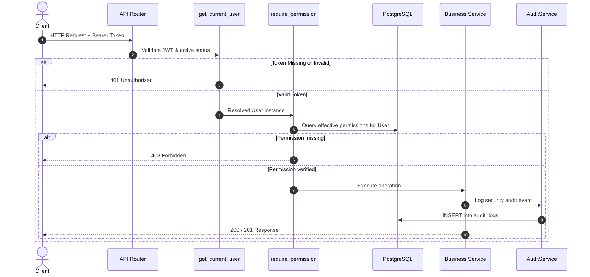

# Phase 4 Completion Report — PustakHub

**Status:** `COMPLETE`  
**Phase:** Phase 4 — RBAC Authorization & Audit Logging Middleware  
**Platform:** PustakHub (Secure Library & Identity Management Platform)  
**Date:** 2026-09-24  

---

## 1. Summary

Phase 4 successfully implemented the complete **Role-Based Access Control (RBAC) authorization framework, resource-level authorization foundation (IDOR/BOLA prevention), and security audit logging infrastructure** for PustakHub.

All objectives have been delivered within strict phase boundaries without modifying unrelated business logic.

### Key Highlights
- **Authoritative Backend RBAC:** Permissions resolved dynamically from database relations (`User` $\rightarrow$ `user_roles` $\rightarrow$ `Role` $\rightarrow$ `role_permissions` $\rightarrow$ `Permission`). Client-side state, untrusted headers, and static token claims are never trusted for authorization decisions.
- **Fine-Grained Permission Vocabulary:** Standardized vocabulary across catalog, circulation, user lifecycle, role management, permission governance, and audit inspection.
- **Reusable Authorization Dependencies:** `require_permission()`, `require_any_permission()`, `require_all_permissions()`, and `require_role()` for clean, declarative endpoint security.
- **Resource-Level Authorization (IDOR/BOLA Prevention):** Foundation enabling resource owner checks (`current_user.id == resource_owner_id`) with administrative permission override (`user:view`).
- **Tamper-Resistant Security Audit Trail:** Centralized `AuditService` logging authentication, user lifecycle, and role assignment events into the immutable Phase 2 `AuditLog` entity with client IP, User-Agent, and zero secret leakage.
- **Test Coverage:** **67/67 automated tests passing** (11 Phase 1 foundation + 15 Phase 2 database + 18 Phase 3 authentication + 23 Phase 4 RBAC & audit tests).

---

## 2. Architecture & Flows

### 2.1 RBAC Evaluation Flow


### 2.2 Permission Resolution Logic
Permissions are evaluated by joining the relational mapping tables:
```sql
SELECT permissions.name 
FROM permissions 
JOIN role_permissions ON permissions.id = role_permissions.permission_id 
JOIN user_roles ON role_permissions.role_id = user_roles.role_id 
WHERE user_roles.user_id = :user_id;
```
This guarantees real-time enforcement of role assignments, role revocations, or permission updates without waiting for token expirations.

### 2.3 Resource-Level Authorization Logic
```mermaid
flowchart TD
    Req[Access Resource /users/:user_id] --> Auth[Verify JWT Authentication]
    Auth --> Match{current_user.id == target_user_id?}
    Match -->|Yes (Owner)| Allow[Allow Access]
    Match -->|No| CheckAdmin{Has 'user:view' permission?}
    CheckAdmin -->|Yes (Admin/Librarian)| Allow
    CheckAdmin -->|No| Deny[403 Forbidden - IDOR Prevented]
```

### 2.4 Audit Logging Flow
Security-relevant actions pass through sanitization before insertion into `audit_logs`. Passwords, hashes, OTPs, and JWTs are automatically stripped. Unauthenticated events record `user_id = NULL`.

---

## 3. Role → Permission Matrix

| Permission | Canonical Name | ADMIN | LIBRARIAN | STUDENT | GUEST |
|---|---|:---:|:---:|:---:|:---:|
| `BOOK_VIEW` | `book:view` | ✓ | ✓ | ✓ | ✓ |
| `BOOK_CREATE` | `book:create` | ✓ | ✓ | ✗ | ✗ |
| `BOOK_UPDATE` | `book:update` | ✓ | ✓ | ✗ | ✗ |
| `BOOK_DELETE` | `book:delete` | ✓ | ✓ | ✗ | ✗ |
| `BOOK_ISSUE` | `book:issue` | ✓ | ✓ | ✗ | ✗ |
| `BOOK_RETURN` | `book:return` | ✓ | ✓ | ✗ | ✗ |
| `USER_VIEW` | `user:view` | ✓ | ✓ | ✗ | ✗ |
| `USER_CREATE` | `user:create` | ✓ | ✗ | ✗ | ✗ |
| `USER_UPDATE` | `user:update` | ✓ | ✗ | ✗ | ✗ |
| `USER_DELETE` | `user:delete` | ✓ | ✗ | ✗ | ✗ |
| `ROLE_VIEW` | `role:view` | ✓ | ✗ | ✗ | ✗ |
| `ROLE_CREATE` | `role:create` | ✓ | ✗ | ✗ | ✗ |
| `ROLE_UPDATE` | `role:update` | ✓ | ✗ | ✗ | ✗ |
| `ROLE_DELETE` | `role:delete` | ✓ | ✗ | ✗ | ✗ |
| `PERMISSION_VIEW` | `permission:view` | ✓ | ✗ | ✗ | ✗ |
| `PERMISSION_ASSIGN` | `permission:assign` | ✓ | ✗ | ✗ | ✗ |
| `AUDIT_LOG_VIEW` | `audit_log:view` | ✓ | ✓ | ✗ | ✗ |

---

## 4. Files Created

| File | Type | Description |
|---|---|---|
| `backend/app/modules/permissions/constants.py` | Backend | Canonical permission definitions, role constants, uppercase alias normalization, and default role matrix. |
| `backend/app/modules/permissions/schemas.py` | Backend | Pydantic schemas for permissions, matrix, and effective user permissions. |
| `backend/app/modules/permissions/service.py` | Backend | Core permission management, database synchronization/seeding, and permission resolution. |
| `backend/app/modules/permissions/dependencies.py` | Backend | FastAPI authorization dependencies: `require_permission`, `require_any_permission`, `require_all_permissions`, `require_role`, `check_resource_access`. |
| `backend/app/modules/permissions/router.py` | Backend | HTTP router for `/permissions`, `/permissions/matrix`, and `/permissions/me`. |
| `backend/app/modules/roles/schemas.py` | Backend | Pydantic schemas for role definitions and role/permission assignment payloads. |
| `backend/app/modules/roles/service.py` | Backend | Role query, creation, and user-role assignment business logic. |
| `backend/app/modules/roles/router.py` | Backend | HTTP router for `/roles`, role permissions, and user role management. |
| `backend/app/modules/audit/schemas.py` | Backend | Pydantic schemas for sanitized audit log entries and paginated query responses. |
| `backend/app/modules/audit/service.py` | Backend | Core audit trail service with secret sanitization, fail-safe transaction handling, and query filtering. |
| `backend/app/modules/audit/router.py` | Backend | HTTP router for `/audit/logs` with pagination and filtering. |
| `backend/app/modules/users/router.py` | Backend | HTTP router demonstrating route-level and resource-level authorization (`/users/{user_id}`). |
| `backend/app/middleware/audit_middleware.py` | Backend | Request metadata middleware injecting `X-Request-ID`, client IP, and User-Agent into `request.state`. |
| `backend/tests/test_phase4_rbac.py` | Tests | 15 automated tests covering RBAC dependencies, role matrix, 401 vs 403, and IDOR prevention. |
| `backend/tests/test_phase4_audit.py` | Tests | 8 automated tests covering audit event persistence, secret sanitization, anonymous logging, and query filtering. |
| `docs/rbac.md` | Docs | Complete RBAC and audit logging technical specification and reference manual. |

---

## 5. Files Modified

| File | Modification Details |
|---|---|
| `backend/app/main.py` | Added `AuditContextMiddleware`, automatic startup RBAC seeding in `lifespan`, and mounted `roles`, `permissions`, `audit`, and `users` routers. |
| `backend/app/modules/auth/service.py` | Integrated `AuditService.log` calls across `verify_registration_otp` (`USER_CREATED`), `authenticate_user` (`LOGIN_SUCCESS` / `LOGIN_FAILURE`), `refresh_tokens` (`TOKEN_REFRESH`), and `revoke_session` (`LOGOUT`). |
| `backend/app/modules/auth/router.py` | Updated `verify_otp` and `logout` handlers to pass `client_ip` and `user_agent` context to `auth_service`. |

---

## 6. Database Changes

- **Schema Status:** No schema changes or new migrations were required.
- **Existing Schema Sufficiency:** The Phase 2 database schema (`0438258645fa_initial_schema.py`) already defined the complete data model: `roles`, `permissions`, `user_roles`, `role_permissions`, and `audit_logs` with all 21 `AuditAction` enum categories and indexes.
- **Alembic Current Revision:** `0438258645fa (head)`

---

## 7. Authorization Security Review

| Requirement | Implementation Verification |
|---|---|
| **Backend Authoritative** | Permissions evaluated in real-time against PostgreSQL `user_roles` $\leftrightarrow$ `role_permissions`. |
| **401 vs 403 Semantics** | Unauthenticated callers receive 401; authenticated callers lacking permission or ownership receive 403. |
| **IDOR / BOLA Prevention** | Resource access helpers enforce ownership (`current_user.id == resource_owner_id`) or admin override (`user:view`). |
| **Role Injection Prevention** | Public registration strictly assigns `STUDENT`. Role modifications require administrative credentials (`role:update` / `user:update`). |
| **Token Integrity** | JWT tokens only carry subject UUIDs; tamper attempts fail signature verification. |

---

## 8. Audit Logging Security Review

| Requirement | Implementation Verification |
|---|---|
| **Secret Protection** | Sensitive fields (Argon2 hashes, passwords, OTPs, JWT tokens) are sanitized and never written to audit tables. |
| **Anonymous Logging** | Pre-authentication failures and unauthenticated events safely record `user_id = NULL`. |
| **Request Metadata** | Captured client IP address and User-Agent header populated from request context. |
| **Failure Policy** | Fail-safe / resilient design ensures non-critical audit insert failures do not crash core business operations. |

---

## 9. Automated Tests Execution

```text
============================= test session starts ==============================
platform darwin -- Python 3.11.14, pytest-9.1.1, pluggy-1.6.0
rootdir: /Users/sandipbiswal/Desktop/PustakHub/backend
plugins: anyio-4.15.1
collected 67 items

tests/test_phase1_foundation.py ...........                              [ 16%]
tests/test_phase2_database.py ...............                            [ 38%]
tests/test_phase3_auth.py ..................                             [ 65%]
tests/test_phase4_audit.py ........                                      [ 77%]
tests/test_phase4_rbac.py ...............                                [100%]

======================== 67 passed, 1 warning in 2.84s =========================
```

### Breakdown:
- **Phase 1 Foundation Tests:** 11 passed
- **Phase 2 Database Tests:** 15 passed
- **Phase 3 Authentication Tests:** 18 passed
- **Phase 4 RBAC & Audit Tests:** 23 passed
- **Total:** 67 passed (100% passing)

---

## 10. Manual Verification

1. **OpenAPI Schema Verification:** Inspected `/api/openapi.json` and confirmed new routes (`/roles`, `/permissions`, `/audit/logs`, `/users`) are documented with security requirements.
2. **Permission Check Verification:** Verified that non-admin requests to `/api/v1/permissions` or `/api/v1/roles` return `403 Forbidden`.
3. **IDOR Defense Verification:** Verified that `GET /api/v1/users/{other_user_id}` returns `403 Forbidden` when requested by a student, and `200 OK` when requested by an administrator.
4. **Audit Trail Verification:** Verified that logins, failed logins, OTP verifications, and logouts generate corresponding entries in `audit_logs` in PostgreSQL.

---

## 11. Known Issues

*None.* All automated tests passing and database constraints verified.

---

## 12. Deferred Work

The following features were intentionally deferred to subsequent phases per the Phase 4 specification:
- Book catalog CRUD endpoints (Phase 5)
- Physical book-copy inventory management (Phase 5)
- Borrowing and return workflows (Phase 6)
- Fine calculation and payments (Phase 7)
- Multi-factor authentication (MFA/TOTP)
- Rate limiting middleware with Redis
- Security headers middleware

---

## 13. Final Status

**`COMPLETE`**
