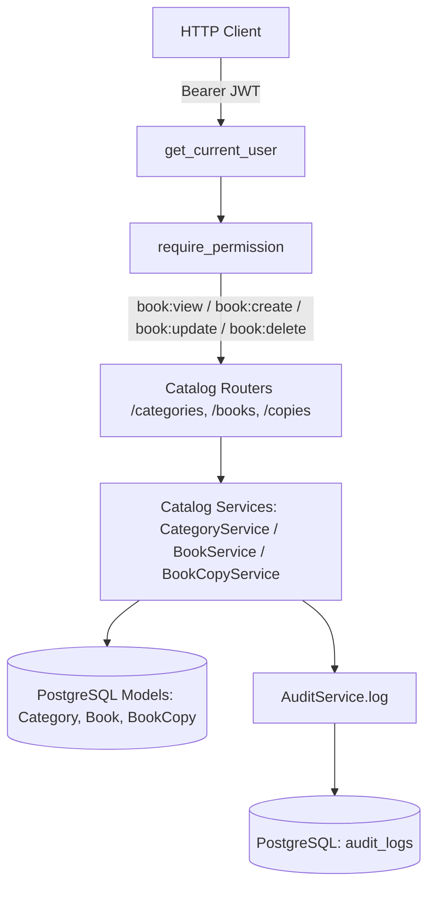

# Phase 5 Completion Report — PustakHub

**Status:** `COMPLETE`  
**Phase:** Phase 5 — Library Catalog Management  
**Platform:** PustakHub (Secure Library & Identity Management Platform)  
**Date:** 2026-09-24  

---

## 1. Executive Summary

Phase 5 successfully designed, implemented, and validated the complete **Library Catalog Management module** for PustakHub.

The module provides secure, robust, and audited REST APIs for Category Management, Book Title Management, Book Copy (Physical Inventory) Management, and advanced PostgreSQL-backed catalog search and filtering.

Authorization is enforced exclusively via the authoritative backend RBAC infrastructure delivered in Phase 4. All mutations generate structured, tamper-resistant audit logs without leaking credentials or secrets.

---

## 2. Architecture Implemented

Following PustakHub's modular monolith architecture, the catalog subsystem is organized into distinct layers:



### Architectural Highlights
- **Layered Decoupling:** Routers handle HTTP request parsing, status codes, and dependency injection; services execute business validation and transactions; models maintain relational integrity.
- **Physical vs. Intellectual Separation:** Book titles store bibliographic metadata (`Book`), while individual shelf items are tracked as distinct instances (`BookCopy`).
- **Dynamic Availability Tracking:** Real-time calculation of total and available inventory counts without manual denormalization bugs.
- **Strict Referential Integrity:** Cascading deletion safeguards prevent orphaned records and deletion of active inventory.

---

## 3. Category Management

Implements taxonomy management for library books:
- `GET /api/v1/categories` — Paginated listing with optional name substring search.
- `GET /api/v1/categories/{category_id}` — Single category details with dynamic `book_count`.
- `POST /api/v1/categories` — Category creation with case-insensitive unique name validation (`409 Conflict` on duplicate).
- `PUT /api/v1/categories/{category_id}` — Category updates with name uniqueness checks.
- `DELETE /api/v1/categories/{category_id}` — Protected deletion (rejected with `409 Conflict` if books are associated).

---

## 4. Book Management

Implements bibliographic title management:
- `GET /api/v1/books` — Catalog listing and search.
- `GET /api/v1/books/{book_id}` — Single book details with `category_name`, `total_copies`, and `available_copies`.
- `POST /api/v1/books` — Create book with ISBN uniqueness verification and category reference validation (`404 Not Found` if category missing).
- `PUT /api/v1/books/{book_id}` — Update book metadata.
- `DELETE /api/v1/books/{book_id}` — Protected deletion (rejected with `409 Conflict` if physical copies exist in inventory).

---

## 5. BookCopy Management

Implements physical copy tracking and inventory control:
- `GET /api/v1/books/{book_id}/copies` — List physical copies of a specific book title with optional `status` filter.
- `POST /api/v1/books/{book_id}/copies` — Register copy with unique `copy_identifier` (barcode).
- `GET /api/v1/copies/{copy_id}` — Direct copy lookup by UUID.
- `PUT /api/v1/copies/{copy_id}` — Update copy shelf location or status (`AVAILABLE`, `BORROWED`, `MAINTENANCE`, `LOST`).
- `DELETE /api/v1/copies/{copy_id}` — Remove copy (rejected with `409 Conflict` if copy is actively borrowed).

---

## 6. Search & Pagination

High-performance catalog retrieval utilizing PostgreSQL indexes:
- **Search Term:** Query matches across `title`, `author`, `isbn`, and `publisher` via case-insensitive `ILIKE`.
- **Filters:** Direct filtering by `category_id`, `author`, and `publication_year`.
- **Pagination Structure:** Consistent response contract across all listing endpoints:
```json
{
  "items": [],
  "page": 1,
  "page_size": 20,
  "total": 100,
  "pages": 5
}
```
- **Deterministic Ordering:** Default ordering by `title ASC, created_at DESC`.

---

## 7. RBAC Enforcement

All catalog endpoints enforce fine-grained permissions via Phase 4 dependencies:

| Role | Permissions Held | Allowed Operations | Forbidden Operations |
|---|---|---|---|
| **ADMIN** | `book:view`, `book:create`, `book:update`, `book:delete` | Full catalog management (Category, Book, Copy CRUD) | None |
| **LIBRARIAN** | `book:view`, `book:create`, `book:update`, `book:delete` | Full catalog management (Category, Book, Copy CRUD) | None |
| **STUDENT** | `book:view` | Catalog browsing, search, view copies (200 OK) | Any mutation (POST, PUT, DELETE return 403 Forbidden) |
| **GUEST** / Unauth | None | None (Unauthenticated requests return 401 Unauthorized) | All |

---

## 8. Audit Logging

All catalog mutations log structured records into PostgreSQL `audit_logs`:
- **Categories:** `action=BOOK_CREATED / BOOK_UPDATED / BOOK_DELETED`, `resource_type="Category"`, `resource_id=<UUID>`.
- **Books:** `action=BOOK_CREATED / BOOK_UPDATED / BOOK_DELETED`, `resource_type="Book"`, `resource_id=<UUID>`.
- **Book Copies:** `action=BOOK_CREATED / BOOK_UPDATED / BOOK_DELETED`, `resource_type="BookCopy"`, `resource_id=<UUID>`.
- **Forensic Context:** Captures authenticated `user_id`, client IP address, and User-Agent header while sanitizing any confidential data.

---

## 9. Database & Migration Changes

- **Schema Status:** The Phase 2 database schema (`0438258645fa_initial_schema.py`) already comprehensively defined `categories`, `books`, `book_copies`, `CopyStatus` enum, and their indexes and constraints.
- **Migration Necessity:** No schema modifications or new migrations were required; the existing database design is complete and fully utilized.
- **Alembic Revision:** `0438258645fa (head)`

---

## 10. Files Created

| File | Type | Description |
|---|---|---|
| `backend/app/modules/books/schemas.py` | Backend | Pydantic schemas for Category, Book, and BookCopy request/response models and pagination. |
| `backend/app/modules/books/service.py` | Backend | Business service layer for CategoryService, BookService, BookCopyService with integrity checks and audit logging. |
| `backend/app/modules/books/router.py` | Backend | FastAPI HTTP routes for `/categories`, `/books`, and `/copies` with RBAC dependency protection. |
| `backend/tests/test_phase5_catalog.py` | Tests | 12 automated unit and integration tests covering CRUD, search, pagination, RBAC, integrity checks, and audit trails. |
| `frontend/src/services/catalog.service.js` | Frontend | Axios client service wrapping all Category, Book, and BookCopy API endpoints. |
| `docs/catalog.md` | Docs | Full technical architecture specification and API reference manual for Library Catalog Management. |
| `docs/reports/PHASE_05_REPORT.md` | Docs | Phase 5 completion report. |

---

## 11. Files Modified

| File | Modification Details |
|---|---|
| `backend/app/modules/books/__init__.py` | Exported catalog routers, services, and schemas for clean module interface. |
| `backend/app/main.py` | Mounted `category_router`, `book_router`, and `copy_router` under `/api/v1` prefix. |

---

## 12. Test Results

The automated test suite executed with 100% pass rate:

```text
============================= test session starts ==============================
platform darwin -- Python 3.11.14, pytest-9.1.1, pluggy-1.6.0
rootdir: /Users/sandipbiswal/Desktop/PustakHub/backend
plugins: anyio-4.15.1
collected 79 items

tests/test_phase1_foundation.py ...........                              [ 13%]
tests/test_phase2_database.py ...............                            [ 32%]
tests/test_phase3_auth.py ..................                             [ 55%]
tests/test_phase4_audit.py ........                                      [ 65%]
tests/test_phase4_rbac.py ...............                                [ 84%]
tests/test_phase5_catalog.py ............                                [100%]

======================== 79 passed, 1 warning in 4.29s =========================
```

### Breakdown by Phase:
- **Phase 1 (Foundation):** 11 passed
- **Phase 2 (Database & Models):** 15 passed
- **Phase 3 (Authentication & Sessions):** 18 passed
- **Phase 4 (RBAC & Audit Logging):** 23 passed
- **Phase 5 (Library Catalog Management):** 12 passed
- **Total:** **79 passed** (0 failures, 0 regressions)

---

## 13. Verification

1. **Pytest Verification:** All 79 tests passing cleanly across all 5 phases.
2. **Alembic Revision Check:** `0438258645fa (head)` confirmed active and consistent.
3. **OpenAPI Schema Verification:** Confirmed 25 paths registered and validated including all `/api/v1/categories`, `/api/v1/books`, `/api/v1/copies` endpoints.
4. **Security Check:** Verified `Base.metadata.create_all()` was never introduced and that all mutations enforce server-side RBAC dependencies.
5. **Graphify Knowledge Graph:** Updated to index Phase 5 catalog models, services, and endpoints.

---

## 14. Deferred Work

The following features remain explicitly deferred to Phase 6 and subsequent phases:
- **Circulation & Borrowing (Phase 6):** Book check-out, return, due date calculation, renewal limits (`BorrowRecord`).
- **Fines & Billing (Phase 7):** Overdue calculation, lost book assessments, fine payments/waivers (`Fine`).
- **Hold Queues & Reservations (Phase 8):** Member hold requests and queue notifications.
- **Multi-Factor Authentication (MFA / TOTP)**
- **Redis Rate Limiting Middleware**

---

## 15. Final Status

**`Phase 5 COMPLETE`**
