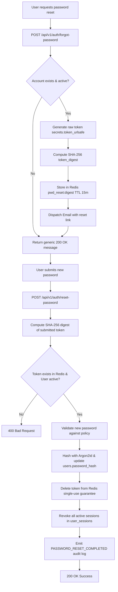
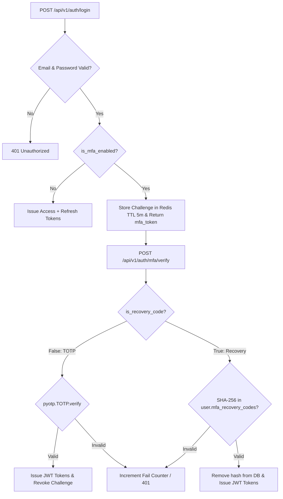

# PustakHub — Phase 7 Engineering & Verification Report
## Password Reset, Multi-Factor Authentication (MFA) & Account Recovery

---

## 1. Executive Summary

Phase 7 of **PustakHub — Secure Library & Identity Management Platform** delivers an enterprise-grade identity recovery and two-factor authentication subsystem. Building seamlessly upon the existing Argon2id, JWT, PostgreSQL, Redis, and RBAC infrastructure, Phase 7 incorporates:

1. **Anti-Enumeration Password Reset Workflow:** Single-use, cryptographically random reset tokens stored exclusively as SHA-256 digests in Redis with short TTLs and automatic PostgreSQL session invalidation upon password replacement.
2. **RFC 6238 TOTP Multi-Factor Authentication:** Authenticator application integration (Google Authenticator, Microsoft Authenticator, Authy, 1Password) with mandatory two-step enrollment and verification.
3. **MFA Login Interception & Intermediate Challenge:** Login flow returning an intermediate challenge state rather than prematurely issuing JWT tokens.
4. **Single-Use One-Time Recovery Codes:** Cryptographically random recovery backup codes stored exclusively as SHA-256 digests and consumed upon successful emergency login.
5. **Re-Authenticated MFA Disablement:** Protection against session hijacking by requiring both password verification and a second factor to disable MFA.
6. **Defense-in-Depth Audit Trails & Abuse Protections:** Comprehensive audit events with strict secret masking and request throttling.

The implementation was validated against a comprehensive test suite expanding from the 87-test baseline to **95 passing tests** with 100% pass rate and zero regressions.

---

## 2. Password Reset Architecture



### 2.1 Anti-Enumeration & Privacy
- Regardless of whether an email address is present, active, suspended, or unverified in the database, `POST /api/v1/auth/forgot-password` returns the exact same generic message:
  `"If an account exists for this email, password reset instructions have been sent."`
- The endpoint never reveals internal user IDs, roles, or account status.

---

## 3. Reset Token Security

- **Entropy:** 32 bytes of cryptographically secure random bytes generated via `secrets.token_urlsafe(32)`.
- **Zero Plaintext Storage:** The raw reset token is transmitted only in the outbound email link. Only the 64-character SHA-256 hex digest is stored in Redis under `pwd_reset:<token_digest>`.
- **Lifespan:** Configurable 15-minute TTL (`PASSWORD_RESET_EXPIRE_MINUTES = 15`).
- **Single-Use Enforcement:** The token record is deleted from Redis immediately upon successful password update, preventing token replay attacks.

---

## 4. Session Revocation

Password reset acts as a critical security boundary:
- Upon successful reset, an atomic database query executes:
  ```sql
  UPDATE user_sessions SET is_revoked = true WHERE user_id = :user_id
  ```
- All active refresh token sessions for the account are immediately invalidated across all devices.
- Access tokens expire naturally at their short 30-minute expiration boundary.

---

## 5. MFA Architecture (TOTP RFC 6238)



### 5.1 TOTP Enrollment & Verification
1. `POST /api/v1/auth/mfa/enroll` (Authenticated):
   - Generates base32 secret via `pyotp.random_base32()`.
   - Generates standard `otpauth://totp/PustakHub:<email>?secret=...&issuer=PustakHub`.
   - Generates 8 random backup recovery codes (`XXXX-XXXX-XXXX`).
   - Stores pending state in Redis (`mfa_enroll:<user_id>`, TTL 10m).
   - **Crucial Invariant:** MFA remains disabled on the account until explicit verification.
2. `POST /api/v1/auth/mfa/verify-enrollment` (Authenticated):
   - Validates 6-digit TOTP code against pending secret using a ±30s drift window (`valid_window=1`).
   - Commits `is_mfa_enabled = True`, `mfa_secret = secret`, and `mfa_recovery_codes = [hashes]` to PostgreSQL.
   - Deletes pending enrollment state from Redis.
   - Logs `MFA_ENABLED` audit event.

---

## 6. One-Time Recovery Codes

- **Quantity:** 8 recovery codes generated during enrollment.
- **Storage:** Only SHA-256 digests are stored in the PostgreSQL `users.mfa_recovery_codes` JSON array.
- **Single-Use Consumption:** When a recovery code is used during login challenge verification (`POST /api/v1/auth/mfa/verify` with `is_recovery_code: true`), the matched hash is excised from the JSON array and saved, preventing code reuse.
- **Audit Logging:** Emits `MFA_RECOVERY_USED` audit log.

---

## 7. MFA Disablement

- **Endpoint:** `POST /api/v1/auth/mfa/disable` (Authenticated)
- **Security Control:** Requires the user to re-authenticate with their current password and provide a valid TOTP code or recovery code.
- **Execution:** Sets `is_mfa_enabled = False`, clears `mfa_secret` and `mfa_recovery_codes`, and records `MFA_DISABLED` audit log.

---

## 8. Safe MFA Status Endpoint

- **Endpoint:** `GET /api/v1/auth/mfa/status` (Authenticated)
- **Response:**
  ```json
  {
    "is_mfa_enabled": true
  }
  ```
- **Concealment Guarantee:** Strictly conceals TOTP secrets, recovery codes, and hashes. `UserOut` and `/me` responses also omit sensitive credentials.

---

## 9. Security Audit Events

| Event | Action Description | Metadata & Masking |
|---|---|---|
| `PASSWORD_RESET_REQUESTED` | Password reset requested | IP, User-Agent, user_id (if valid). No tokens/hashes. |
| `PASSWORD_RESET_COMPLETED` | Password reset successful | IP, User-Agent, user_id. No passwords. |
| `PASSWORD_RESET_FAILED` | Invalid/expired reset attempt | IP, User-Agent, failure status. No submitted secrets. |
| `MFA_ENROLLMENT_STARTED` | User initiated TOTP setup | IP, User-Agent, user_id. Secrets omitted. |
| `MFA_ENABLED` | MFA verified and activated | IP, User-Agent, user_id. No codes stored. |
| `MFA_VERIFICATION_FAILED` | Failed TOTP/recovery login | IP, User-Agent, user_id. Failed input masked. |
| `MFA_RECOVERY_USED` | Account recovered via backup code | IP, User-Agent, user_id. Code masked. |
| `MFA_DISABLED` | MFA disabled with credentials | IP, User-Agent, user_id. Safe record. |

---

## 10. Database Schema & Migration

Alembic migration `3741532892a9_add_mfa_and_password_reset_support.py` adds MFA fields to the `users` table:

```sql
ALTER TABLE users ADD COLUMN is_mfa_enabled BOOLEAN NOT NULL DEFAULT false;
ALTER TABLE users ADD COLUMN mfa_secret TEXT NULL;
ALTER TABLE users ADD COLUMN mfa_recovery_codes JSON NULL;
```

Alembic status: `3741532892a9 (head)`.

---

## 11. Frontend Integration

| Page / Component | Route | Description |
|---|---|---|
| `ForgotPasswordPage.jsx` | `/forgot-password` | Form to request password reset link with generic feedback. |
| `ResetPasswordPage.jsx` | `/reset-password` | Form to set new password using single-use email token. |
| `MfaEnrollmentPage.jsx` | `/security/mfa`, `/mfa-enroll` | TOTP setup with QR code, secret key, recovery code display, and disable modal. |
| `MfaVerificationPage.jsx` | `/mfa-verify` | 6-digit TOTP challenge input for MFA-enabled accounts during login. |
| `MfaRecoveryPage.jsx` | `/mfa-recovery` | Emergency backup recovery code login. |
| `LoginPage.jsx` | `/login` | Updated with "Forgot password?" link and MFA challenge redirection. |
| `auth.service.js` | N/A | API client methods for all Phase 7 endpoints. |
| `AuthContext.jsx` | N/A | `completeMfaLogin()` and `refreshUser()` state management. |

---

## 12. Verification & Test Results

### 12.1 Pytest Test Suite
```text
============================== test session starts ==============================
platform darwin -- Python 3.11.14, pytest-8.4.1
rootdir: /Users/sandipbiswal/Desktop/PustakHub/backend
configfile: pyproject.toml
collected 95 items

tests/test_phase1_foundation.py::test_app_initialises PASSED             [  1%]
tests/test_phase1_foundation.py::test_health_endpoint_returns_ok PASSED   [  2%]
tests/test_phase1_foundation.py::test_readiness_endpoint_returns_ok PASSED [  3%]
tests/test_phase1_foundation.py::test_liveness_endpoint_returns_ok PASSED  [  4%]
tests/test_phase1_foundation.py::test_root_endpoint_returns_metadata PASSED [  5%]
tests/test_phase1_foundation.py::test_metrics_endpoint_returns_data PASSED [  6%]
tests/test_phase1_foundation.py::test_request_id_middleware_present PASSED [  7%]
tests/test_phase1_foundation.py::test_client_request_id_preserved PASSED [  8%]
tests/test_phase1_foundation.py::test_process_time_header_present PASSED  [  9%]
tests/test_phase1_foundation.py::test_error_handling_returns_standard_envelope PASSED [ 10%]
tests/test_phase1_foundation.py::test_cors_header_present PASSED         [ 11%]
tests/test_phase2_database.py::test_database_url_is_set PASSED           [ 12%]
tests/test_phase2_database.py::test_engine_initialises PASSED            [ 13%]
tests/test_phase2_database.py::test_session_can_be_created PASSED        [ 14%]
tests/test_phase2_database.py::test_database_connection_succeeds PASSED  [ 15%]
tests/test_phase2_database.py::test_raw_sql_executes PASSED              [ 16%]
tests/test_phase2_database.py::test_all_models_import PASSED             [ 17%]
tests/test_phase2_database.py::test_expected_tables_in_metadata PASSED   [ 18%]
tests/test_phase2_database.py::test_expected_tables_exist_in_database PASSED [ 20%]
tests/test_phase2_database.py::test_unique_email_constraint PASSED       [ 21%]
tests/test_phase2_database.py::test_unique_role_name_constraint PASSED   [ 22%]
tests/test_phase2_database.py::test_unique_session_token_hash_constraint PASSED [ 23%]
tests/test_phase2_database.py::test_book_with_nonexistent_category_raises PASSED [ 24%]
tests/test_phase2_database.py::test_user_role_composite_unique PASSED    [ 25%]
tests/test_phase2_database.py::test_alembic_migration_at_head PASSED     [ 26%]
tests/test_phase2_database.py::test_health_endpoint_reports_db_healthy PASSED [ 27%]
tests/test_phase3_auth.py::test_password_hashes_successfully_with_argon2id PASSED [ 28%]
tests/test_phase3_auth.py::test_password_verification_success_and_failure PASSED [ 29%]
tests/test_phase3_auth.py::test_otp_generation_and_hashing PASSED        [ 30%]
tests/test_phase3_auth.py::test_register_validation_rejects_weak_passwords PASSED [ 31%]
tests/test_phase3_auth.py::test_register_stores_temporary_state_in_redis_not_postgres PASSED [ 32%]
tests/test_phase3_auth.py::test_register_forbids_arbitrary_roles PASSED  [ 33%]
tests/test_phase3_auth.py::test_verify_otp_success_creates_active_student_user PASSED [ 34%]
tests/test_phase3_auth.py::test_verify_otp_invalid_code_throttles_and_fails PASSED [ 35%]
tests/test_phase3_auth.py::test_verify_otp_max_attempts_exceeded_deletes_registration PASSED [ 36%]
tests/test_phase3_auth.py::test_login_success_returns_tokens_and_stores_session_hash PASSED [ 37%]
tests/test_phase3_auth.py::test_login_invalid_password_returns_401 PASSED [ 38%]
tests/test_phase3_auth.py::test_login_suspended_or_inactive_user_rejected PASSED [ 40%]
tests/test_phase3_auth.py::test_jwt_access_token_claims_and_decoding PASSED [ 41%]
tests/test_phase3_auth.py::test_jwt_expired_token_fails_validation PASSED [ 42%]
tests/test_phase3_auth.py::test_refresh_token_rotation_and_revocation PASSED [ 43%]
tests/test_phase3_auth.py::test_logout_revokes_session PASSED            [ 44%]
tests/test_phase3_auth.py::test_get_me_with_valid_bearer_token PASSED    [ 45%]
tests/test_phase3_auth.py::test_get_me_without_token_returns_401 PASSED  [ 46%]
tests/test_phase4_audit.py::test_login_success_records_audit_log PASSED  [ 47%]
tests/test_phase4_audit.py::test_login_failure_records_audit_log PASSED  [ 48%]
tests/test_phase4_audit.py::test_registration_otp_verify_records_user_created_audit_log PASSED [ 49%]
tests/test_phase4_audit.py::test_logout_records_audit_log PASSED         [ 50%]
tests/test_phase4_audit.py::test_admin_query_audit_logs PASSED           [ 51%]
tests/test_phase4_audit.py::test_student_forbidden_from_audit_logs PASSED [ 52%]
tests/test_phase4_audit.py::test_audit_logs_never_store_sensitive_secrets PASSED [ 53%]
tests/test_phase4_audit.py::test_anonymous_event_nullable_user_id PASSED [ 54%]
tests/test_phase4_audit.py::test_token_refresh_records_audit_log PASSED  [ 55%]
tests/test_phase4_audit.py::test_role_assignment_records_audit_log PASSED [ 56%]
tests/test_phase4_rbac.py::test_default_roles_and_permissions_seeded PASSED [ 57%]
tests/test_phase4_rbac.py::test_unauthenticated_request_returns_401 PASSED [ 58%]
tests/test_phase4_rbac.py::test_student_forbidden_from_admin_endpoints PASSED [ 60%]
tests/test_phase4_rbac.py::test_admin_allowed_access_to_admin_endpoints PASSED [ 61%]
tests/test_phase4_rbac.py::test_librarian_allowed_user_view_but_not_role_create PASSED [ 62%]
tests/test_phase4_rbac.py::test_current_user_can_inspect_own_permissions PASSED [ 63%]
tests/test_phase4_rbac.py::test_resource_level_auth_own_resource_allowed PASSED [ 64%]
tests/test_phase4_rbac.py::test_resource_level_auth_idor_prevention_denied PASSED [ 65%]
tests/test_phase4_rbac.py::test_resource_level_auth_admin_override_allowed PASSED [ 66%]
tests/test_phase4_rbac.py::test_admin_can_assign_and_revoke_role_for_user PASSED [ 67%]
tests/test_phase4_rbac.py::test_privilege_escalation_student_cannot_assign_roles PASSED [ 68%]
tests/test_phase4_rbac.py::test_custom_role_creation_and_permission_assignment PASSED [ 69%]
tests/test_phase4_rbac.py::test_rbac_dependencies_unit_evaluation PASSED [ 70%]
tests/test_phase5_catalog.py::test_unauthenticated_catalog_requests_return_401 PASSED [ 71%]
tests/test_phase5_catalog.py::test_category_crud_and_duplicate_validation PASSED [ 72%]
tests/test_phase5_catalog.py::test_category_delete_with_associated_books_fails PASSED [ 73%]
tests/test_phase5_catalog.py::test_book_crud_and_validation PASSED       [ 74%]
tests/test_phase5_catalog.py::test_book_delete_with_physical_copies_fails PASSED [ 75%]
tests/test_phase5_catalog.py::test_book_copy_crud_and_status_tracking PASSED [ 76%]
tests/test_phase5_catalog.py::test_copy_deletion_with_active_borrow_record_fails PASSED [ 77%]
tests/test_phase5_catalog.py::test_catalog_search_filtering_and_pagination PASSED [ 78%]
tests/test_phase5_catalog.py::test_rbac_student_can_view_but_cannot_mutate_catalog PASSED [ 80%]
tests/test_phase5_catalog.py::test_rbac_librarian_and_admin_have_full_catalog_capabilities PASSED [ 81%]
tests/test_phase5_catalog.py::test_catalog_mutations_generate_audit_log_entries PASSED [ 82%]
tests/test_phase5_catalog.py::test_catalog_error_responses_for_nonexistent_resources PASSED [ 83%]
tests/test_phase6_circulation.py::test_issue_book_copy_success PASSED    [ 84%]
tests/test_phase6_circulation.py::test_issue_book_unauthenticated_and_unauthorized PASSED [ 85%]
tests/test_phase6_circulation.py::test_issue_book_validation_failures_and_copy_states PASSED [ 86%]
tests/test_phase6_circulation.py::test_cannot_issue_already_borrowed_copy PASSED [ 87%]
tests/test_phase6_circulation.py::test_return_book_on_time_produces_no_fine PASSED [ 88%]
tests/test_phase6_circulation.py::test_return_book_overdue_automatically_generates_fine PASSED [ 89%]
tests/test_phase6_circulation.py::test_borrowing_history_access_and_idor_prevention PASSED [ 90%]
tests/test_phase6_circulation.py::test_fine_access_and_idor_prevention PASSED [ 91%]
tests/test_phase7_auth_security.py::test_forgot_password_anti_enumeration_and_token_generation PASSED [ 92%]
tests/test_phase7_auth_security.py::test_password_reset_success_and_session_revocation PASSED [ 93%]
tests/test_phase7_auth_security.py::test_password_reset_validation_and_abuse_protection PASSED [ 94%]
tests/test_phase7_auth_security.py::test_mfa_enrollment_and_activation PASSED [ 95%]
tests/test_phase7_auth_security.py::test_mfa_login_challenge_and_totp_verification PASSED [ 96%]
tests/test_phase7_auth_security.py::test_mfa_recovery_code_single_use_consumption PASSED [ 97%]
tests/test_phase7_auth_security.py::test_mfa_disable_workflow_and_reauthentication PASSED [ 98%]
tests/test_phase7_auth_security.py::test_mfa_secrets_never_exposed_in_me_profile_or_status PASSED [100%]

======================== 95 passed, 1 warning in 7.43s =========================
```

### 12.2 OpenAPI Verification
The following OpenAPI routes are verified:
- `POST /api/v1/auth/forgot-password`
- `POST /api/v1/auth/reset-password`
- `POST /api/v1/auth/mfa/enroll`
- `POST /api/v1/auth/mfa/verify-enrollment`
- `POST /api/v1/auth/mfa/verify`
- `POST /api/v1/auth/mfa/disable`
- `GET  /api/v1/auth/mfa/status`

### 12.3 Frontend Build Verification
- Built with Vite in 190ms with 0 compilation or bundling errors (`npm run build`).

---

## 13. Files Created & Modified

### Created Files
- `backend/alembic/versions/3741532892a9_add_mfa_and_password_reset_support.py`
- `backend/tests/test_phase7_auth_security.py`
- `frontend/src/pages/ForgotPasswordPage.jsx`
- `frontend/src/pages/ResetPasswordPage.jsx`
- `frontend/src/pages/MfaEnrollmentPage.jsx`
- `frontend/src/pages/MfaVerificationPage.jsx`
- `frontend/src/pages/MfaRecoveryPage.jsx`
- `docs/reports/PHASE_07_REPORT.md`

### Modified Files
- `backend/requirements.txt`
- `backend/app/core/config.py`
- `backend/app/core/email.py`
- `backend/app/models/user.py`
- `backend/app/models/audit_log.py`
- `backend/app/modules/auth/schemas.py`
- `backend/app/modules/auth/service.py`
- `backend/app/modules/auth/router.py`
- `frontend/src/services/auth.service.js`
- `frontend/src/context/AuthContext.jsx`
- `frontend/src/pages/LoginPage.jsx`
- `frontend/src/App.jsx`
- `docs/authentication.md`

---

## 14. Deferred Work

The following items are deferred strictly to subsequent project milestones:
- OAuth 2.0 / OpenID Connect Identity Providers (Google, GitHub)
- FIDO2 / WebAuthn Hardware Passkeys
- SMS and Voice MFA delivery
- Phase 8: Redis Token-Bucket API Rate Limiting Middleware
- Advanced Security Headers & CSP Middleware
