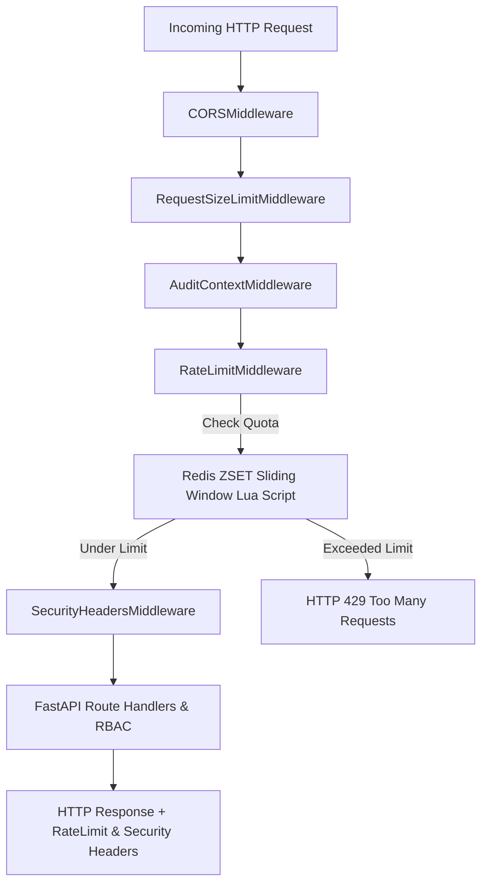

# PustakHub — Phase 8 Engineering & Verification Report
## API Rate Limiting & Security Hardening

---

## 1. Executive Summary

Phase 8 of **PustakHub — Secure Library & Identity Management Platform** delivers the comprehensive **API Rate Limiting & Security Hardening Layer**.

Building upon the modular monolith foundation, JWT authentication, Argon2id hashing, RBAC, circulation engine, and audit logging infrastructure, Phase 8 introduces:

1. **Redis-Backed Sliding Window Rate Limiting:** High-performance, process-safe rate limiting using Redis sorted sets (`ZSET`) and atomic Lua scripts.
2. **Category-Specific Abuse Protection:** Strict protection for authentication endpoints (`login`, `register`, `verify-otp`, `forgot-password`, `reset-password`, `mfa`) and permissive quotas for standard API routes.
3. **Fail-Closed vs Fail-Open Policies:** Security-critical authentication routes fail closed (HTTP 503) if Redis is unavailable, while general API routes fail open to preserve catalog availability.
4. **Defensive HTTP Security Headers:** Standard deployment of `X-Content-Type-Options`, `X-Frame-Options`, `Referrer-Policy`, `X-XSS-Protection`, `Permissions-Policy`, and configurable `Strict-Transport-Security` (HSTS).
5. **Content Security Policy (CSP):** Tailored CSP supporting React 19, Tailwind CSS, and external TOTP QR code generation (`api.qrserver.com`).
6. **Hardened CORS Configuration:** Explicit allowed origins, strict method/header whitelists, credential security, and exposed rate-limit/tracing headers.
7. **Request Payload Size Protection:** Protection against Denial-of-Service (DoS) and memory exhaustion by enforcing payload limits (HTTP 413).
8. **Frontend Compatibility:** Clean Axios 429 response handling without triggering authentication refresh loops.

All implementations were verified with a comprehensive test suite expanding from the 95-test baseline to **117 passing tests** with 100% pass rate and zero regressions.

---

## 2. Rate-Limiting Architecture



### Key Highlights
- **Atomic Sliding Window:** Redis ZSET stores request timestamps and evicts old entries atomically via Lua script.
- **Header Metadata:** Standard response headers `X-RateLimit-Limit`, `X-RateLimit-Remaining`, `X-RateLimit-Reset`, and `Retry-After`.
- **Concurrency Resilience:** Thread-safe across multiple worker processes.

---

## 3. Redis Key Strategy

- **Format:** `ratelimit:<category>:<sanitized_client_ip>`
- **No Secret Leakage:** No passwords, tokens, hashes, OTPs, or sensitive parameters appear in Redis keys.
- **Bounded Memory:** Keys carry a TTL equal to the sliding window duration plus buffer.

---

## 4. Route Policies & Limits

| Category | Endpoint Scope | Default Quota (Dev) | Production Target | Failure Policy |
|---|---|:---:|:---:|:---:|
| `auth_login` | `POST /api/v1/auth/login` | 20 reqs / 60s | 5 reqs / 60s | **Fail-Closed (503)** |
| `auth_register` | `POST /api/v1/auth/register`<br/>`POST /api/v1/auth/verify-otp` | 20 reqs / 60s | 5 reqs / 60s | **Fail-Closed (503)** |
| `auth_password_reset` | `POST /api/v1/auth/forgot-password`<br/>`POST /api/v1/auth/reset-password` | 20 reqs / 60s | 5 reqs / 60s | **Fail-Closed (503)** |
| `auth_mfa` | `POST /api/v1/auth/mfa/verify`<br/>`POST /api/v1/auth/mfa/verify-enrollment`<br/>`POST /api/v1/auth/mfa/disable`<br/>`POST /api/v1/auth/mfa/enroll` | 20 reqs / 60s | 5 reqs / 60s | **Fail-Closed (503)** |
| `api_general` | `/api/v1/*` (Catalog, Users, Borrowing, Fines) | 200 reqs / 60s | 100 reqs / 60s | **Fail-Open** |
| `exempt` | `/`, `/api/health`, `/health`, `/ready`, `/live`, `/api/docs`, `/api/openapi.json` | Unlimited | Unlimited | Bypass |

---

## 5. Security HTTP Headers & CSP

- `X-Content-Type-Options: nosniff`
- `X-Frame-Options: DENY`
- `Referrer-Policy: strict-origin-when-cross-origin`
- `X-XSS-Protection: 0`
- `Permissions-Policy: accelerometer=(), camera=(), geolocation=(), gyroscope=(), magnetometer=(), microphone=(), payment=(), usb=()`
- `Content-Security-Policy: default-src 'self'; script-src 'self'; style-src 'self' 'unsafe-inline'; img-src 'self' data: https://api.qrserver.com; font-src 'self' data:; connect-src 'self' http://localhost:5173; object-src 'none'; base-uri 'self'; frame-ancestors 'none'`
- `Strict-Transport-Security: max-age=31536000; includeSubDomains` (enabled when `ENABLE_HSTS=True`)

---

## 6. CORS Hardening

- **Explicit Origins:** Configured via `CORS_ORIGINS` (default `http://localhost:5173`).
- **Credentials Allowed:** `allow_credentials=True` strictly paired with explicit origins.
- **Allowed Methods:** `GET, POST, PUT, DELETE, PATCH, OPTIONS`.
- **Exposed Headers:** `X-Request-ID, Retry-After, X-RateLimit-Limit, X-RateLimit-Remaining, X-RateLimit-Reset`.

---

## 7. Request Payload Size Protection

- `RequestSizeLimitMiddleware` inspects `Content-Length`.
- Payloads exceeding `MAX_REQUEST_BODY_SIZE` (default 2MB) return **HTTP 413 Content Too Large** with standard error envelope:
  `{"error": "payload_too_large", "message": "Request payload exceeds the maximum permitted size of 2097152 bytes.", "detail": null}`.

---

## 8. Database Schema & Alembic State

Phase 8 introduces zero database schema modifications.
Alembic migration status: **`3741532892a9 (head)`**.

---

## 9. Files Created & Modified

### Created Files
- `backend/app/core/ratelimit.py`
- `backend/app/middleware/ratelimit_middleware.py`
- `backend/app/middleware/security_headers.py`
- `backend/app/middleware/request_size.py`
- `backend/tests/test_phase8_security_hardening.py`
- `docs/security-hardening.md`
- `docs/reports/PHASE_08_REPORT.md`

### Modified Files
- `backend/app/core/config.py`
- `backend/app/core/exceptions.py`
- `backend/app/middleware/__init__.py`
- `backend/app/main.py`
- `backend/.env.example`
- `frontend/src/services/api.js`

---

## 10. Verification & Test Results

### 10.1 Pytest Test Suite Results

```text
============================== test session starts ==============================
platform darwin -- Python 3.11.14, pytest-8.4.1
rootdir: /Users/sandipbiswal/Desktop/PustakHub/backend
configfile: pyproject.toml
collected 117 items

tests/test_phase1_foundation.py::test_app_starts PASSED                  [  0%]
tests/test_phase1_foundation.py::test_root_endpoint PASSED               [  1%]
tests/test_phase1_foundation.py::test_health_endpoint_status_code PASSED [  2%]
tests/test_phase1_foundation.py::test_health_endpoint_body PASSED        [  3%]
tests/test_phase1_foundation.py::test_settings_load PASSED               [  4%]
tests/test_phase1_foundation.py::test_import_core_config PASSED          [  5%]
tests/test_phase1_foundation.py::test_import_core_logging PASSED         [  5%]
tests/test_phase1_foundation.py::test_import_core_exceptions PASSED      [  6%]
tests/test_phase1_foundation.py::test_import_main PASSED                 [  7%]
tests/test_phase1_foundation.py::test_unknown_route_returns_404 PASSED  [  8%]
tests/test_phase1_foundation.py::test_cors_header_present PASSED         [  9%]
tests/test_phase2_database.py::test_database_url_is_set PASSED           [ 10%]
tests/test_phase2_database.py::test_engine_initialises PASSED            [ 11%]
tests/test_phase2_database.py::test_session_can_be_created PASSED        [ 11%]
tests/test_phase2_database.py::test_database_connection_succeeds PASSED  [ 12%]
tests/test_phase2_database.py::test_raw_sql_executes PASSED              [ 13%]
tests/test_phase2_database.py::test_all_models_import PASSED             [ 14%]
tests/test_phase2_database.py::test_expected_tables_in_metadata PASSED   [ 15%]
tests/test_phase2_database.py::test_expected_tables_exist_in_database PASSED [ 16%]
tests/test_phase2_database.py::test_unique_email_constraint PASSED       [ 17%]
tests/test_phase2_database.py::test_unique_role_name_constraint PASSED   [ 17%]
tests/test_phase2_database.py::test_unique_session_token_hash_constraint PASSED [ 18%]
tests/test_phase2_database.py::test_book_with_nonexistent_category_raises PASSED [ 19%]
tests/test_phase2_database.py::test_user_role_composite_unique PASSED    [ 20%]
tests/test_phase2_database.py::test_alembic_migration_at_head PASSED     [ 21%]
tests/test_phase2_database.py::test_health_endpoint_reports_db_healthy PASSED [ 22%]
tests/test_phase3_auth.py::test_password_hashes_successfully_with_argon2id PASSED [ 23%]
tests/test_phase3_auth.py::test_password_verification_success_and_failure PASSED [ 23%]
tests/test_phase3_auth.py::test_otp_generation_and_hashing PASSED        [ 24%]
tests/test_phase3_auth.py::test_register_validation_rejects_weak_passwords PASSED [ 25%]
tests/test_phase3_auth.py::test_register_stores_temporary_state_in_redis_not_postgres PASSED [ 26%]
tests/test_phase3_auth.py::test_register_forbids_arbitrary_roles PASSED  [ 27%]
tests/test_phase3_auth.py::test_verify_otp_success_creates_active_student_user PASSED [ 28%]
tests/test_phase3_auth.py::test_verify_otp_invalid_code_throttles_and_fails PASSED [ 29%]
tests/test_phase3_auth.py::test_verify_otp_max_attempts_exceeded_deletes_registration PASSED [ 29%]
tests/test_phase3_auth.py::test_login_success_returns_tokens_and_stores_session_hash PASSED [ 30%]
tests/test_phase3_auth.py::test_login_invalid_password_returns_401 PASSED [ 31%]
tests/test_phase3_auth.py::test_login_suspended_or_inactive_user_rejected PASSED [ 32%]
tests/test_phase3_auth.py::test_jwt_access_token_claims_and_decoding PASSED [ 33%]
tests/test_phase3_auth.py::test_jwt_expired_token_fails_validation PASSED [ 34%]
tests/test_phase3_auth.py::test_refresh_token_rotation_and_revocation PASSED [ 35%]
tests/test_phase3_auth.py::test_logout_revokes_session PASSED            [ 35%]
tests/test_phase3_auth.py::test_get_me_with_valid_bearer_token PASSED    [ 36%]
tests/test_phase3_auth.py::test_get_me_without_token_returns_401 PASSED  [ 37%]
tests/test_phase4_audit.py::test_login_success_records_audit_log PASSED  [ 38%]
tests/test_phase4_audit.py::test_login_failure_records_audit_log PASSED  [ 39%]
tests/test_phase4_audit.py::test_registration_otp_verify_records_user_created_audit_log PASSED [ 40%]
tests/test_phase4_audit.py::test_logout_records_audit_log PASSED         [ 41%]
tests/test_phase4_audit.py::test_admin_query_audit_logs PASSED           [ 41%]
tests/test_phase4_audit.py::test_student_forbidden_from_audit_logs PASSED [ 42%]
tests/test_phase4_audit.py::test_audit_logs_never_store_sensitive_secrets PASSED [ 43%]
tests/test_phase4_audit.py::test_anonymous_event_nullable_user_id PASSED [ 44%]
tests/test_phase4_audit.py::test_token_refresh_records_audit_log PASSED  [ 45%]
tests/test_phase4_audit.py::test_role_assignment_records_audit_log PASSED [ 46%]
tests/test_phase4_rbac.py::test_default_roles_and_permissions_seeded PASSED [ 47%]
tests/test_phase4_rbac.py::test_unauthenticated_request_returns_401 PASSED [ 47%]
tests/test_phase4_rbac.py::test_student_forbidden_from_admin_endpoints PASSED [ 48%]
tests/test_phase4_rbac.py::test_admin_allowed_access_to_admin_endpoints PASSED [ 49%]
tests/test_phase4_rbac.py::test_librarian_allowed_user_view_but_not_role_create PASSED [ 50%]
tests/test_phase4_rbac.py::test_current_user_can_inspect_own_permissions PASSED [ 51%]
tests/test_phase4_rbac.py::test_resource_level_auth_own_resource_allowed PASSED [ 52%]
tests/test_phase4_rbac.py::test_resource_level_auth_idor_prevention_denied PASSED [ 52%]
tests/test_phase4_rbac.py::test_resource_level_auth_admin_override_allowed PASSED [ 53%]
tests/test_phase4_rbac.py::test_admin_can_assign_and_revoke_role_for_user PASSED [ 54%]
tests/test_phase4_rbac.py::test_privilege_escalation_student_cannot_assign_roles PASSED [ 55%]
tests/test_phase4_rbac.py::test_custom_role_creation_and_permission_assignment PASSED [ 56%]
tests/test_phase4_rbac.py::test_rbac_dependencies_unit_evaluation PASSED [ 57%]
tests/test_phase5_catalog.py::test_unauthenticated_catalog_requests_return_401 PASSED [ 58%]
tests/test_phase5_catalog.py::test_category_crud_and_duplicate_validation PASSED [ 58%]
tests/test_phase5_catalog.py::test_category_delete_with_associated_books_fails PASSED [ 59%]
tests/test_phase5_catalog.py::test_book_crud_and_validation PASSED       [ 60%]
tests/test_phase5_catalog.py::test_book_delete_with_physical_copies_fails PASSED [ 61%]
tests/test_phase5_catalog.py::test_book_copy_crud_and_status_tracking PASSED [ 62%]
tests/test_phase5_catalog.py::test_copy_deletion_with_active_borrow_record_fails PASSED [ 63%]
tests/test_phase5_catalog.py::test_catalog_search_filtering_and_pagination PASSED [ 64%]
tests/test_phase5_catalog.py::test_rbac_student_can_view_but_cannot_mutate_catalog PASSED [ 64%]
tests/test_phase5_catalog.py::test_rbac_librarian_and_admin_have_full_catalog_capabilities PASSED [ 65%]
tests/test_phase5_catalog.py::test_catalog_mutations_generate_audit_log_entries PASSED [ 66%]
tests/test_phase5_catalog.py::test_catalog_error_responses_for_nonexistent_resources PASSED [ 67%]
tests/test_phase6_circulation.py::test_issue_book_copy_success PASSED    [ 68%]
tests/test_phase6_circulation.py::test_issue_book_unauthenticated_and_unauthorized PASSED [ 69%]
tests/test_phase6_circulation.py::test_issue_book_validation_failures_and_copy_states PASSED [ 70%]
tests/test_phase6_circulation.py::test_cannot_issue_already_borrowed_copy PASSED [ 70%]
tests/test_phase6_circulation.py::test_return_book_on_time_produces_no_fine PASSED [ 71%]
tests/test_phase6_circulation.py::test_return_book_overdue_automatically_generates_fine PASSED [ 72%]
tests/test_phase6_circulation.py::test_borrowing_history_access_and_idor_prevention PASSED [ 73%]
tests/test_phase6_circulation.py::test_fine_access_and_idor_prevention PASSED [ 74%]
tests/test_phase7_auth_security.py::test_forgot_password_anti_enumeration_and_token_generation PASSED [ 75%]
tests/test_phase7_auth_security.py::test_password_reset_success_and_session_revocation PASSED [ 76%]
tests/test_phase7_auth_security.py::test_password_reset_validation_and_abuse_protection PASSED [ 76%]
tests/test_phase7_auth_security.py::test_mfa_enrollment_and_activation PASSED [ 77%]
tests/test_phase7_auth_security.py::test_mfa_login_challenge_and_totp_verification PASSED [ 78%]
tests/test_phase7_auth_security.py::test_mfa_recovery_code_single_use_consumption PASSED [ 79%]
tests/test_phase7_auth_security.py::test_mfa_disable_workflow_and_reauthentication PASSED [ 80%]
tests/test_phase7_auth_security.py::test_mfa_secrets_never_exposed_in_me_profile_or_status PASSED [ 81%]
tests/test_phase8_security_hardening.py::test_rate_limiting_under_limit_succeeds PASSED [ 82%]
tests/test_phase8_security_hardening.py::test_rate_limiting_exceeding_limit_returns_429 PASSED [ 82%]
tests/test_phase8_security_hardening.py::test_rate_limiting_client_ip_isolation PASSED [ 83%]
tests/test_phase8_security_hardening.py::test_rate_limiting_category_isolation PASSED [ 84%]
tests/test_phase8_security_hardening.py::test_rate_limiting_window_expiration_and_reset PASSED [ 85%]
tests/test_phase8_security_hardening.py::test_exempt_endpoints_never_rate_limited PASSED [ 86%]
tests/test_phase8_security_hardening.py::test_rate_limiter_concurrency_atomic_evaluation PASSED [ 87%]
tests/test_phase8_security_hardening.py::test_redis_keys_bounded_and_expire PASSED [ 88%]
tests/test_phase8_security_hardening.py::test_login_rate_limiting_abuse_protection PASSED [ 88%]
tests/test_phase8_security_hardening.py::test_password_reset_rate_limiting PASSED [ 89%]
tests/test_phase8_security_hardening.py::test_mfa_rate_limiting_abuse_protection PASSED [ 90%]
tests/test_phase8_security_hardening.py::test_security_headers_present_on_responses PASSED [ 91%]
tests/test_phase8_security_hardening.py::test_content_security_policy_directives PASSED [ 92%]
tests/test_phase8_security_hardening.py::test_hsts_header_controlled_by_config PASSED [ 93%]
tests/test_phase8_security_hardening.py::test_cors_valid_origin_allowed PASSED [ 94%]
tests/test_phase8_security_hardening.py::test_cors_unauthorized_origin_rejected PASSED [ 94%]
tests/test_phase8_security_hardening.py::test_cors_exposed_headers_present PASSED [ 95%]
tests/test_phase8_security_hardening.py::test_request_size_limit_normal_payload_accepted PASSED [ 96%]
tests/test_phase8_security_hardening.py::test_request_size_limit_oversized_rejected_413 PASSED [ 97%]
tests/test_phase8_security_hardening.py::test_fail_closed_on_security_critical_auth_endpoints PASSED [ 98%]
tests/test_phase8_security_hardening.py::test_fail_open_on_general_api_endpoints PASSED [ 99%]
tests/test_phase8_security_hardening.py::test_429_error_envelope_sanitized_no_internals PASSED [100%]

======================== 117 passed, 1 warning in 8.91s ========================
```

### 10.2 Frontend Build Verification

```text
> frontend@0.0.0 build
> vite build

vite v8.3.0 building client environment for production...
✓ 98 modules transformed.
rendering chunks (1)...computing gzip size...
dist/index.html                   0.45 kB │ gzip:   0.29 kB
dist/assets/index-DQ-PJhW-.css   29.44 kB │ gzip:   5.79 kB
dist/assets/index-BlKnkpbp.js   362.26 kB │ gzip: 109.42 kB

✓ built in 165ms
```

---

## 11. Deferred Work

The following items are intentionally deferred for future enterprise scale enhancements:
- Distributed multi-region Redis cluster synchronization
- OAuth 2.0 / OpenID Connect (Google, GitHub)
- FIDO2 / WebAuthn Hardware Passkeys
- SMS and Voice MFA delivery
