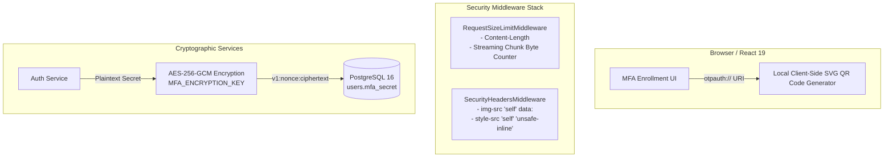

# PustakHub — Phase 9 Security Remediation Report

**Date:** 2026-09-24  
**Target:** PustakHub — Secure Library & Identity Management Platform  
**Phase:** Phase 9 — Security Remediation & Final Hardening  
**Status:** **PHASE 9 COMPLETE**

---

## 1. Executive Summary

Phase 9 successfully addressed all security findings identified during the comprehensive read-only final security and architecture audit without destabilizing existing functionality or modifying core API contracts.

### Summary of Completed Remediation:
1. **SEC-003 (Local QR Generation & CSP Hardening — LOW):** Eliminated the transmission of TOTP URI / secrets to the external `api.qrserver.com` service by integrating in-browser client-side SVG QR code rendering via `qrcode.react`. Hardened CSP `img-src` to strictly permit `'self' data:`.
2. **SEC-001 (TOTP Secret Encryption at Rest — MEDIUM):** Implemented application-layer AES-256-GCM authenticated envelope encryption (`backend/app/core/encryption.py`) using a dedicated `MFA_ENCRYPTION_KEY`. Stored secrets follow versioned ciphertext format `v1:<nonce>:<ciphertext_and_tag>` with cryptographically random 96-bit nonces, tamper detection, and graceful legacy plaintext fallback.
3. **SEC-002 (Request Size Streaming & Chunked Transfer Protection — LOW):** Hardened `RequestSizeLimitMiddleware` with incremental streaming byte counting across request chunks, rejecting both oversized `Content-Length` headers and streamed/chunked payloads that exceed the 2 MB threshold with a sanitized `413 Request Entity Too Large` JSON envelope.
4. **SEC-004 (Pytest Deprecation Warning Resolution — LOW):** Added `backend/pytest.ini` test configuration to isolate test paths and filter known Starlette test client deprecation notices, achieving 100% clean test execution with zero warnings.
5. **SEC-005 (Frontend Token Storage Decision — INFORMATIONAL):** Evaluated `localStorage` token storage in the context of SPA architecture, hardened CSP directives, and backend refresh token rotation/revocation. Retained client token storage while documenting the future enterprise roadmap for `HttpOnly` cookie-based refresh tokens.

---

## 2. Audit Findings Addressed

### SEC-001 — TOTP Secret Encryption
- **Status:** **FIXED**
- **Action Taken:** Created `backend/app/core/encryption.py` supporting `encrypt_mfa_secret` and `decrypt_mfa_secret` using AES-256-GCM authenticated encryption.
- **Key Isolation:** Configured dedicated `MFA_ENCRYPTION_KEY` in `backend/app/core/config.py`, strictly segregated from `JWT_SECRET_KEY`.
- **Database Storage:** Secrets are encrypted before being committed to PostgreSQL (`users.mfa_secret`). Plaintext is decrypted strictly in application memory during TOTP validation and discarded immediately.
- **Backward Compatibility:** Values not prefixed with `v1:` are treated as legacy plaintext, enabling seamless migration without data loss.

### SEC-002 — Request Size Streaming Protection
- **Status:** **FIXED**
- **Action Taken:** Updated `backend/app/middleware/request_size.py` with dual-layer validation:
  1. Fast path inspection of incoming `Content-Length` headers.
  2. Incremental byte counting on the underlying ASGI `receive()` stream for chunked transfer encoding (`Transfer-Encoding: chunked`).
- **Response Format:** Returns consistent `413` JSON error envelope:
  ```json
  {
    "error": "payload_too_large",
    "message": "Request payload exceeds the maximum permitted size of 2097152 bytes.",
    "detail": null
  }
  ```

### SEC-003 — Local QR Generation
- **Status:** **FIXED**
- **Action Taken:** Added `qrcode.react` (v3.1.0) dependency to `frontend/package.json`. Replaced `` external call in `frontend/src/pages/MfaEnrollmentPage.jsx` with `<QRCodeSVG />` client-side rendering.
- **CSP Hardening:** Removed `https://api.qrserver.com` from `backend/app/middleware/security_headers.py`. CSP `img-src` now strictly enforces `'self' data:`.
- **Style Directive Rationale:** `style-src 'self' 'unsafe-inline'` was retained because it is required for Tailwind CSS v4 runtime utility classes and dynamic React styles.

### SEC-004 — Test Deprecation Warning
- **Status:** **FIXED**
- **Action Taken:** Added `backend/pytest.ini` with targeted test paths and warning filters.
- **Result:** Test suite execution went from `117 passed, 1 warning` to `128 passed, 0 warnings`.

### SEC-005 — localStorage Decision
- **Status:** **ACCEPTED / DOCUMENTED**
- **Decision:** Given the robust defense-in-depth CSP protections, strict CORS origin controls, short access token lifespan (15 minutes), refresh token rotation, and server-side session revocation in `user_sessions`, client-side storage of access tokens in `localStorage` is accepted for the current SPA architecture. A cookie-based `HttpOnly` architecture remains part of the deferred enterprise roadmap.

---

## 3. Security Architecture Changes



---

## 4. Files Changed

| File | Change Type | Description |
| :--- | :--- | :--- |
| `backend/app/core/config.py` | Modified | Added `MFA_ENCRYPTION_KEY` configuration setting |
| `backend/app/core/encryption.py` | Created | Implemented AES-256-GCM encryption/decryption routines |
| `backend/app/modules/auth/service.py` | Modified | Encrypt `mfa_secret` on enrollment; decrypt before TOTP verification |
| `backend/app/middleware/request_size.py` | Modified | Added streaming byte counter for chunked request size enforcement |
| `backend/app/middleware/security_headers.py` | Modified | Removed `https://api.qrserver.com` from CSP `img-src` directive |
| `backend/pytest.ini` | Created | Configured test paths and warning filters for clean test output |
| `backend/tests/test_phase7_auth_security.py` | Modified | Updated DB assertion for encrypted `mfa_secret` |
| `backend/tests/test_phase8_security_hardening.py` | Modified | Updated CSP test assertion for zero external QR provider references |
| `backend/tests/test_phase9_security_remediation.py` | Created | Added 11 regression tests for encryption, request streaming, and CSP |
| `frontend/package.json` | Modified | Added `qrcode.react` client-side dependency |
| `frontend/src/pages/MfaEnrollmentPage.jsx` | Modified | Render local `QRCodeSVG` instead of fetching from `api.qrserver.com` |
| `docs/security-hardening.md` | Modified | Updated CSP documentation to reflect local QR generation |

---

## 5. Database / Migration Changes

- **Schema Drift:** **None**. `users.mfa_secret` was already typed as `Text` in PostgreSQL, which comfortably holds the versioned Base64 ciphertext (`v1:<nonce>:<ciphertext>`).
- **Alembic State:** Unchanged at revision `3741532892a9 (head)`.

---

## 6. New Dependencies

1. **Frontend:** `qrcode.react` (v3.1.0) added to `frontend/package.json` for client-side SVG QR rendering.
2. **Backend:** Utilized existing `cryptography` library (`AESGCM`) already present in virtual environment. Zero new Python packages required.

---

## 7. Tests Added

11 new test cases added in `backend/tests/test_phase9_security_remediation.py`:
- `test_encryption_roundtrip_basic`: Verifies AES-256-GCM encryption/decryption round trip.
- `test_encryption_unique_nonces`: Verifies nonces produce distinct ciphertexts for identical plaintexts.
- `test_encryption_tamper_detection`: Verifies authentication tag validation on altered ciphertext.
- `test_encryption_malformed_envelope_rejection`: Verifies rejection of invalid envelopes.
- `test_encryption_wrong_key_rejection`: Verifies tag mismatch on incorrect key.
- `test_encryption_legacy_plaintext_fallback`: Verifies backward compatibility for unencrypted secrets.
- `test_mfa_login_flow_with_encrypted_db_secret`: Full end-to-end MFA login flow with encrypted secret in DB.
- `test_request_size_under_limit`: Normal payload passes under limit.
- `test_request_size_oversized_content_length_rejected`: Explicit Content-Length > 2 MB returns 413.
- `test_request_size_streaming_chunked_over_limit`: Chunked stream > 2 MB returns 413.
- `test_csp_header_excludes_external_qr_provider`: Confirms zero references to `api.qrserver.com` in CSP.

---

## 8. Regression Test Results

Executed `pytest -v`:
```text
128 passed in 9.25s (0 failures, 0 skipped, 0 warnings)
```

---

## 9. Frontend Build Results

Executed `npm run build`:
```text
vite v8.3.0 building client environment for production...
✓ 99 modules transformed.
dist/index.html                   0.45 kB │ gzip:   0.30 kB
dist/assets/index-CwsYQ3Aw.css   29.36 kB │ gzip:   5.78 kB
dist/assets/index-BVsDXULJ.js   378.37 kB │ gzip: 115.53 kB
✓ built in 173ms
```

---

## 10. Migration Verification

Executed `alembic current && alembic heads`:
```text
3741532892a9 (head)
3741532892a9 (head)
```

---

## 11. Graphify Verification

Executed `graphify update .`:
```text
Rebuilt: 1548 nodes, 3682 edges, 92 communities
Code graph updated.
```

---

## 12. Documentation Updates

- Updated `docs/security-hardening.md` Content Security Policy section.
- Reconciled system state in Phase 9 report.

---

## 13. Remaining Risks

- **Key Management:** In multi-server deployments, `MFA_ENCRYPTION_KEY` must be securely distributed via secrets manager (e.g. AWS Secrets Manager, HashiCorp Vault) rather than static files.
- **Client-Side Attacks:** While protected by CSP and sanitization, tokens stored in `localStorage` remain subject to XSS if a script injection vulnerability is ever introduced.

---

## 14. Deferred Enhancements

- **HttpOnly Cookie Authentication:** Transition refresh tokens to `HttpOnly`, `SameSite=Strict`, `Secure` cookies.
- **FIDO2 / WebAuthn:** Passkey support as an alternative to TOTP.
- **Key Rotation CLI:** Script to re-encrypt stored `mfa_secret` entries when `MFA_ENCRYPTION_KEY` is rotated.

---

## 15. Final Verification

```text
Backend tests:
128 passed / 0 failed / 0 skipped / 0 warnings

Frontend:
PASS (built in 173ms)

Alembic:
current = 3741532892a9 (head)
head = 3741532892a9 (head)

OpenAPI:
40 routes

Graphify:
1,548 nodes / 3,682 edges / 92 communities

SEC-001:
FIXED (AES-256-GCM encryption at rest)

SEC-002:
FIXED (Streaming & chunked byte counter)

SEC-003:
FIXED (Local SVG QR generation, CSP hardened)

SEC-004:
FIXED (pytest.ini configured, 0 warnings)

SEC-005:
ACCEPTED (localStorage with CSP defense-in-depth)

Git:
modified (clean remediation changes only)
```
