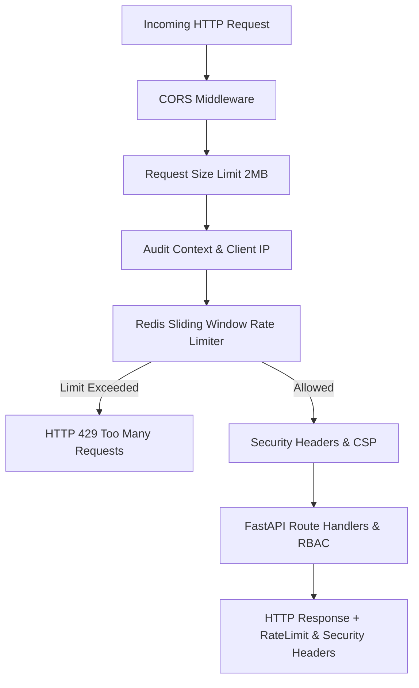
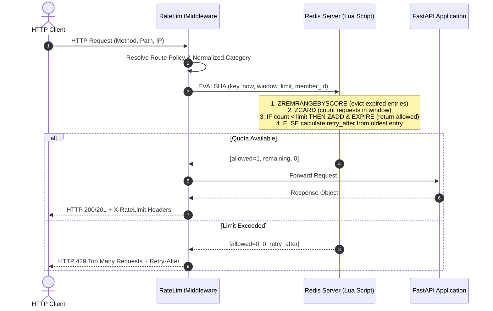

# PustakHub — API Rate Limiting & Security Hardening (Phase 8)

## 1. Executive Summary

Phase 8 introduces the final planned **API Security Hardening Layer** for **PustakHub — Secure Library & Identity Management Platform**.

Building upon the established modular monolith, JWT authentication, Argon2id hashing, RBAC, and audit trail systems, this phase adds multi-layered defense-in-depth security:



---

## 2. Redis-Backed API Rate Limiting

PustakHub implements an **atomic sliding-window rate limiter** powered by Redis sorted sets (`ZSET`) and Lua scripting. This ensures accurate, process-safe, non-leaky rate limiting that functions deterministically across multiple application server instances.

### 2.1 Sliding Window Algorithm



### 2.2 Redis Key Strategy

- **Format:** `ratelimit:<category>:<sanitized_client_ip>`
- **Examples:**
  - `ratelimit:auth_login:192.0.2.1`
  - `ratelimit:auth_register:192.0.2.1`
  - `ratelimit:auth_password_reset:192.0.2.1`
  - `ratelimit:auth_mfa:192.0.2.1`
  - `ratelimit:api_general:192.0.2.1`
- **Zero-Secret Invariant:** Passwords, JWTs, refresh tokens, OTPs, TOTP codes, and reset tokens are **NEVER** placed inside Redis keys.
- **Anti-Explosion Guarantee:** Normalized categories prevent attackers from generating infinite arbitrary Redis keys via malicious URL parameters.

### 2.3 Route Category Policies & Quotas

| Category | Endpoints / Methods | Default Limit | Window | Failure Policy |
|---|---|:---:|:---:|:---:|
| `auth_login` | `POST /api/v1/auth/login` | 20 reqs (prod: 5) | 60s | **Fail-Closed (HTTP 503)** |
| `auth_register` | `POST /api/v1/auth/register`<br/>`POST /api/v1/auth/verify-otp` | 20 reqs (prod: 5) | 60s | **Fail-Closed (HTTP 503)** |
| `auth_password_reset` | `POST /api/v1/auth/forgot-password`<br/>`POST /api/v1/auth/reset-password` | 20 reqs (prod: 5) | 60s | **Fail-Closed (HTTP 503)** |
| `auth_mfa` | `POST /api/v1/auth/mfa/verify`<br/>`POST /api/v1/auth/mfa/verify-enrollment`<br/>`POST /api/v1/auth/mfa/disable`<br/>`POST /api/v1/auth/mfa/enroll` | 20 reqs (prod: 5) | 60s | **Fail-Closed (HTTP 503)** |
| `api_general` | `/api/v1/books*`, `/api/v1/categories*`, `/api/v1/users*`, `/api/v1/borrowings*`, `/api/v1/fines*`, etc. | 200 reqs (prod: 100) | 60s | **Fail-Open** |
| `exempt` | `/`, `/api/health`, `/health`, `/ready`, `/live`, `/api/docs`, `/api/redoc`, `/api/openapi.json` | Unlimited | N/A | Bypass |

---

## 3. Rate Limit Response Semantics

When rate limit is exceeded, the server returns **HTTP 429 Too Many Requests**:

```http
HTTP/1.1 429 Too Many Requests
Content-Type: application/json
Retry-After: 48
X-RateLimit-Limit: 20
X-RateLimit-Remaining: 0
X-RateLimit-Reset: 1727201234
```

```json
{
  "error": "rate_limit_exceeded",
  "message": "Too many requests. Please try again later.",
  "detail": null
}
```

### Standard Rate Limit Headers

- `X-RateLimit-Limit`: Maximum permitted requests within the rolling window.
- `X-RateLimit-Remaining`: Remaining request quota for the calling client in the current window.
- `X-RateLimit-Reset`: Unix epoch timestamp when the quota resets.
- `Retry-After`: Number of seconds to wait before retrying (returned on HTTP 429 responses).

---

## 4. Fail-Open vs Fail-Closed Policy

A critical architectural decision is handling Redis downtime:

1. **Security-Critical Endpoints (Fail-Closed):**
   - Endpoints: Login, Registration, OTP Verification, Password Reset, MFA Challenge/Verification.
   - Behavior: If Redis is unreachable, requests are **blocked with HTTP 503 Service Unavailable**.
   - Rationale: Prevents adversaries from launching brute-force attacks when Redis is temporarily disabled or unreachable.

2. **Standard API Endpoints (Fail-Open):**
   - Endpoints: Catalog queries, book browsing, borrowing history, fine inspection.
   - Behavior: If Redis is unreachable, requests **proceed directly to the application service**.
   - Rationale: Preserves read-only uptime and patron services without causing total platform failure during cache downtime.

---

## 5. Security HTTP Headers

All HTTP responses pass through `SecurityHeadersMiddleware` which applies modern security headers:

| Header | Configured Value | Security Purpose |
|---|---|---|
| `X-Content-Type-Options` | `nosniff` | Prevents MIME-type sniffing attacks. |
| `X-Frame-Options` | `DENY` | Prevents clickjacking by forbidding embedding in iframes. |
| `Referrer-Policy` | `strict-origin-when-cross-origin` | Minimizes leakage of sensitive URLs across origins. |
| `X-XSS-Protection` | `0` | Disables legacy buggy XSS auditor in favor of CSP. |
| `Permissions-Policy` | `accelerometer=(), camera=(), geolocation=(), gyroscope=(), magnetometer=(), microphone=(), payment=(), usb=()` | Disables unwanted browser device capabilities. |
| `Content-Security-Policy` | Tailored policy (see below) | Restricts authorized script, style, and media sources. |
| `Strict-Transport-Security` | `max-age=31536000; includeSubDomains` | Enforces HTTPS in production deployments (`ENABLE_HSTS=True`). |

---

## 6. Content Security Policy (CSP)

The Content Security Policy is tailored specifically to the React 19 + Tailwind CSS frontend application:

```text
default-src 'self';
script-src 'self';
style-src 'self' 'unsafe-inline';
img-src 'self' data:;
font-src 'self' data:;
connect-src 'self' http://localhost:5173;
object-src 'none';
base-uri 'self';
frame-ancestors 'none';
```

- **`style-src 'self' 'unsafe-inline'`**: Required for Tailwind CSS runtime utilities and React dynamic inline styles.
- **`img-src 'self' data:`**: Self-hosted and inline data images only. Eliminates third-party QR code generation APIs by rendering TOTP QR codes locally in the browser via `qrcode.react`.
- **`object-src 'none'`**: Disallows Flash, Java, and legacy browser plugins.
- **`frame-ancestors 'none'`**: Complement to `X-Frame-Options: DENY`.

---

## 7. Hardened CORS Configuration

FastAPI `CORSMiddleware` is configured with strict production-ready defaults:

- **Explicit Origins:** Loaded strictly from `settings.cors_origins_list` (never `*` when credentials are used).
- **Credentials Allowed:** `allow_credentials=True` paired only with explicit origins.
- **Permitted Methods:** `["GET", "POST", "PUT", "DELETE", "PATCH", "OPTIONS"]`.
- **Permitted Headers:** `["Authorization", "Content-Type", "X-Request-ID", "Accept", "Origin", "X-Requested-With"]`.
- **Exposed Headers:** `["X-Request-ID", "Retry-After", "X-RateLimit-Limit", "X-RateLimit-Remaining", "X-RateLimit-Reset"]`.
- **Max Age:** 600 seconds (10 minutes) for preflight caching.

---

## 8. Request Body Size Protection

To prevent memory exhaustion and Denial-of-Service attacks via oversized JSON bodies:
- `RequestSizeLimitMiddleware` inspects `Content-Length`.
- Payloads exceeding `MAX_REQUEST_BODY_SIZE` (default `2MB = 2097152 bytes`) are rejected immediately with **HTTP 413 Content Too Large**:

```json
{
  "error": "payload_too_large",
  "message": "Request payload exceeds the maximum permitted size of 2097152 bytes.",
  "detail": null
}
```

---

## 9. Security Logging & Redaction

### Rules Enforced
- **Never Logged:**
  - `Authorization` header contents
  - JWT access and refresh tokens
  - Plaintext passwords or Argon2id hashes
  - OTP codes and verification digests
  - TOTP secret keys and recovery codes
  - Redis connection URLs and credentials
- **Audit & Forensic Logging:**
  - Rate-limit violations emit `logger.warning` events with client IP and route category.
  - Sensitive events continue leveraging `AuditService.log` for tamper-resistant PostgreSQL audit trail persistence.

---

## 10. Frontend Compatibility

The frontend Axios client (`frontend/src/services/api.js`) handles rate limits cleanly:
- On `429 Too Many Requests`, requests are rejected without triggering the `401 Unauthorized` token refresh loop.
- User-facing error notifications display the backend rate-limit message.

---

## 11. Production Deployment Recommendations

Before deploying to production, verify the following environment settings:

```ini
# Production Environment Configuration
ENVIRONMENT=production
DEBUG=false

# Explicit Frontend Domain (No Wildcards)
CORS_ORIGINS=https://pustakhub.yourdomain.com

# Strict Rate Limits
RATE_LIMIT_ENABLED=true
RATE_LIMIT_AUTH_REQUESTS=5
RATE_LIMIT_AUTH_WINDOW_SECONDS=60
RATE_LIMIT_REGISTER_REQUESTS=5
RATE_LIMIT_REGISTER_WINDOW_SECONDS=60
RATE_LIMIT_PASSWORD_RESET_REQUESTS=5
RATE_LIMIT_PASSWORD_RESET_WINDOW_SECONDS=60
RATE_LIMIT_MFA_REQUESTS=5
RATE_LIMIT_MFA_WINDOW_SECONDS=60
RATE_LIMIT_API_REQUESTS=100
RATE_LIMIT_API_WINDOW_SECONDS=60
RATE_LIMIT_FAIL_CLOSED_AUTH=true

# Security Headers & HTTPS Enforcement
ENABLE_SECURITY_HEADERS=true
ENABLE_CSP=true
ENABLE_HSTS=true
HSTS_MAX_AGE=31536000
HSTS_INCLUDE_SUBDOMAINS=true
```
