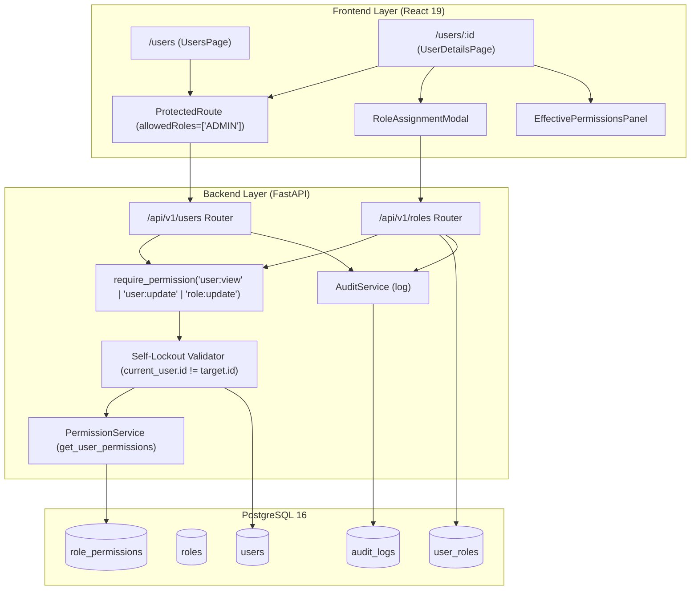

# User & IAM Administration Architecture

## Overview

The **User & Identity and Access Management (IAM) Administration** module provides authorized system administrators (`ADMIN` role) with an interface and secure API foundation to inspect user identities, audit and modify account lifecycle statuses, assign or revoke security roles, and analyze effective dynamic permissions derived through Role-Based Access Control (RBAC).

PustakHub enforces the strict architectural rule:

$$\text{User} \longrightarrow \text{Role} \longrightarrow \text{Permissions} \longrightarrow \text{Resource}$$

The backend remains the authoritative gatekeeper for all IAM operations. Frontend permission checks (`usePermissions`, `PermissionGate`, `ProtectedRoute`) serve exclusively as user experience controls and never replace server-side authorization.

---

## Architecture & Security Boundaries



---

## Routes & User Experience

### 1. Administrative Users Ledger (`/users`)
- **Route:** `/users`
- **Access:** `ADMIN` role required.
- **Features:**
  - Full-text search by user name or email address.
  - Multi-criteria filtering by account status (`ACTIVE`, `SUSPENDED`, `DEACTIVATED`) and role (`ADMIN`, `LIBRARIAN`, `STUDENT`, `GUEST`).
  - High-level IAM metrics: Total users, Active accounts, Suspended accounts, Staff members count.
  - Responsive tabular ledger with status and role badges, MFA indicators, creation timestamps, and direct navigation to user details.
  - Robust empty states, loading skeletons, and retry capabilities.

### 2. User Profile & IAM Inspection (`/users/:id`)
- **Route:** `/users/:id`
- **Access:** `ADMIN` role required.
- **Features:**
  - **Identity Metadata:** UUID, Full Name, Email, Account Status, Email Verification state, MFA TOTP Enrollment status, Created Date, Updated Date.
  - **Account Status Transition Controls:** Immediate transition between `ACTIVE`, `SUSPENDED`, and `DEACTIVATED` with destructive action warnings via `ConfirmDialog`.
  - **Assigned Roles Management:** List of assigned roles with `RoleBadge`, role granting modal with elevated privilege warnings, and per-role revocation controls.
  - **Dynamic Effective Permissions:** Visual breakdown of effective permissions grouped by domain (`Book Catalog`, `Circulation & Loans`, `User Administration`, `Role & IAM Management`, `Security & Audit Logs`).
  - **Patron Circulation Activity:** Live summary of active loans and checkouts associated with the user ID.

---

## Defensive Self-Protection & Lockout Prevention

A critical security risk in IAM administration is accidental administrative self-lockout or privilege destruction. PustakHub implements dual-layer protection:

### Frontend UX Guards
- The currently authenticated user is detected via `currentUser.id === id`.
- Status transition buttons (`Suspend`, `Deactivate`) are disabled for the active administrator with explanatory tooltips.
- Role revocation for the `ADMIN` role on one's own account is disabled.
- A prominent alert banner notifies the administrator that self-protection safeguards are active.

### Backend Authoritative Enforcements
- In `PATCH /api/v1/users/{user_id}/status`:
  ```python
  if current_user.id == target_user.id and data.account_status != AccountStatus.ACTIVE:
      raise HTTPException(
          status_code=status.HTTP_400_BAD_REQUEST,
          detail="Self-lockout protection: You cannot deactivate or suspend your own active administrator account.",
      )
  ```
- In `DELETE /api/v1/users/{user_id}/roles/{role_name}`:
  ```python
  if current_user.id == user_id and role_name.upper() == "ADMIN":
      raise HTTPException(
          status_code=status.HTTP_400_BAD_REQUEST,
          detail="Self-lockout protection: You cannot revoke your own ADMIN role.",
      )
  ```
- Client-supplied identity headers or query IDs are strictly ignored in favor of the cryptographically verified JWT identity extracted by `get_current_user`.

---

## Zero Sensitive Credential Leakage

All endpoints returning user data use strict Pydantic models (`UserOut`) and explicit field mapping to guarantee that authentication secrets are never exposed over the wire:

| Sensitive Field | DB Column | Exposed in API? | Protection Mechanism |
| :--- | :--- | :--- | :--- |
| Password Hash | `password_hash` | **NO (Stripped)** | Omitted from `UserOut` schema |
| MFA Secret Key | `mfa_secret` | **NO (Stripped)** | Omitted from `UserOut` schema |
| MFA Recovery Codes | `mfa_recovery_codes` | **NO (Stripped)** | Omitted from `UserOut` schema |
| Refresh Token Hash | Redis / Session | **NO (Stripped)** | Isolated in HTTP-only cookies / Redis |
| Password Reset Token | Redis / Cache | **NO (Stripped)** | Short-lived token in Redis cache |

---

## IAM Audit Trail Integration

All administrative mutations generate immutable entries in the `audit_logs` table via `AuditService`:

| Action | Trigger | Actor ID | Target Resource ID | Status |
| :--- | :--- | :--- | :--- | :--- |
| `USER_SUSPENDED` | Account suspended | Administrator UUID | `{user_id}:SUSPENDED` | `SUCCESS` |
| `USER_DEACTIVATED` | Account deactivated | Administrator UUID | `{user_id}:DEACTIVATED` | `SUCCESS` |
| `USER_UPDATED` | Account reactivated/updated | Administrator UUID | `{user_id}:ACTIVE` | `SUCCESS` |
| `ROLE_ASSIGNED` | Role granted to user | Administrator UUID | `{user_id}:{role_name}` | `SUCCESS` |
| `ROLE_REVOKED` | Role revoked from user | Administrator UUID | `{user_id}:{role_name}` | `SUCCESS` |

---

## API Endpoints Reference

| Method | Endpoint | Required Permission | Description |
| :--- | :--- | :--- | :--- |
| `GET` | `/api/v1/users` | `user:view` | List users with optional `search`, `status`/`account_status`, and `role` query filters. |
| `GET` | `/api/v1/users/{id}` | `user:view` (or owner) | Retrieve user profile metadata. |
| `PATCH` | `/api/v1/users/{id}/status` | `user:update` | Update user account status (`ACTIVE`, `SUSPENDED`, `DEACTIVATED`). |
| `GET` | `/api/v1/users/{id}/permissions` | `user:view` | Get resolved effective dynamic permissions for user. |
| `GET` | `/api/v1/roles` | `role:view` | List all system roles and descriptions. |
| `POST` | `/api/v1/users/{id}/roles` | `role:update` or `user:update` | Assign an existing system role to target user. |
| `DELETE` | `/api/v1/users/{id}/roles/{role}` | `role:update` or `user:update` | Revoke a role from target user. |

---

## Known Limitations & Boundaries

1. **Permission Authoring:** System permissions and canonical role definitions remain defined in database seed fixtures (`DEFAULT_ROLE_PERMISSIONS`). Frontend arbitrary permission creation is deliberately omitted to prevent unauthorized privilege broadening.
2. **Audit Management UI:** Dedicated query and log filtering UI is deferred to Phase 16 (Audit Management UI).
3. **Session Invalidation:** Deactivating an account blocks subsequent token refreshes and mutations; active in-flight JWTs expire naturally within their 15-minute validity window.
